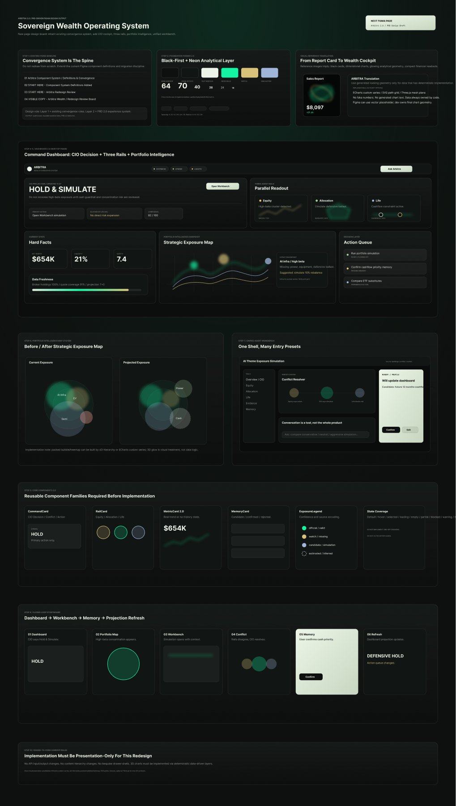
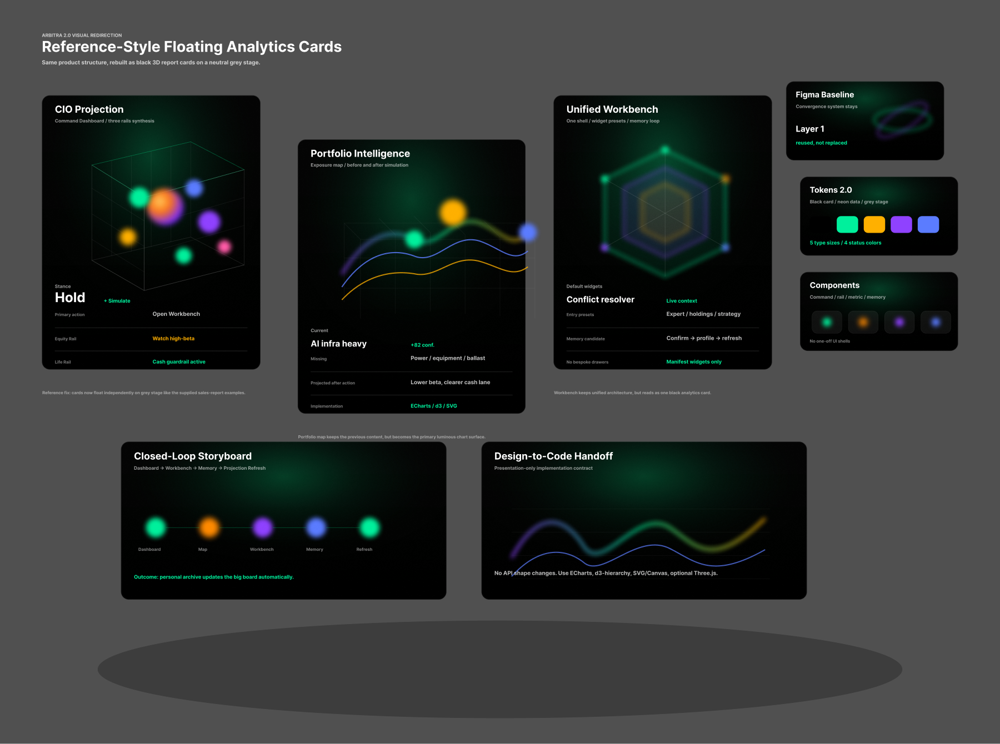

# AI Personal Wealth Master 2.0 PRD

版本：v0.2
日期：2026-06-09
定位：重大产品与架构改版基准文档
读者：后续开发执行者、产品设计、Agent 架构维护者

## 1. 一句话定位

AI Personal Wealth Master 2.0 要从“财富仪表盘 + 多个专家弹窗”升级为“个人主权财富操作系统”。

系统不再只是回答用户问题，而是持续接收用户输入、真实资产数据、市场上下文与人生约束，沉淀为唯一的长期个人档案，并通过统一 Agent Workbench 进行三路并行分析，最终把综合建议和各路专业建议自动投射回大盘。

目标产品心智：

- 用户看到的是一个统一、冷静、可持续认识自己的财富系统。
- 任意入口打开的都是同一套决策工作台，而不是分裂的功能弹窗。
- Agent 不是一个聊天人格，而是一套可解释、可审计、可扩展的财富决策链路。
- 大盘结果不是孤立 AI 文案，而是个人档案、当前资产事实、市场上下文与策略裁决的实时投影。

## 2. 当前问题总结

### 2.1 Agent 链路问题

当前链路大致为：

用户输入 -> RAG/意图识别 -> Hydrator 补水 -> Debt/HNW/General/Market/Devil 并行 -> CEO Synthesizer 统一输出 -> 前端状态 Patch

它不是纯线形，内部已有专家并行，但并行维度主要按“用户财富层级/专家人格”拆分，而不是按真实财富决策域拆分。

问题：

- 股票、基金、现金流、人生规划最终被压进同一个综合器。
- Market Agent 语义过强，容易让所有问题偏向市场分析。
- 基金/ETF/长期配置没有独立证据标准。
- 人生规划、税务、家庭责任等长期约束没有同等强度的数据链路。
- Synthesizer 同时承担总结、冲突裁决、UI Patch、状态更新、动态卡片生成，职责过载。

### 2.2 Drawer 体系问题

当前存在多个类似但机制不同的抽屉/弹窗：

- 主 AI Drawer
- WidgetCopilot
- PositionIntelligenceDrawer
- PortfolioReviewDrawer
- ProfileReportView 入口
- DeveloperView 的 Agent/RAG 配置

问题：

- 每个 Drawer 自带一套初始 UI、上下文、请求方式和状态逻辑。
- 初始展示硬编码，无法根据入口智能组合 widgets。
- 新增入口需要新增一套 Drawer 或大量条件逻辑。
- ActionButton、卡片点击、持仓分析、复盘分析都会进入不同基础设施。
- 用户体验像多个功能点，架构也真的分裂成多个小产品。

### 2.3 长期记忆与个人档案问题

当前与长期记忆高度重叠的模块包括：

- 大盘顶部战略结果
- Drawer 中“写入长线记忆”开关与手动确认
- DeveloperView / Agent Prompt 控制面板里的 RAG Schema 表格
- 头像下拉里的长线记忆入口
- 用户个人档案面板
- Portfolio Review Memory
- AgentAnalysisSnapshot
- Firestore chatHistory / userProfile

问题：

- 多处都在表达“系统记住了我”，但没有一个唯一 canonical profile。
- RAG Schema、个人档案、记忆确认、复盘记忆、顶部总结边界不清。
- 用户不知道哪些内容真的被长期记住，哪些只是一次对话上下文。
- 大盘结果与长期档案不是严格派生关系，容易出现“档案没变但大盘变了”或“记忆已确认但大盘不响应”。

## 3. 2.0 产品目标

### 3.1 核心目标

建立四个统一底座：

1. Agent Workbench
2. Sovereign Profile
3. Memory Inbox
4. Dashboard Projection

四者关系：

Workbench 负责接收和分析。
Memory Inbox 负责候选记忆确认与治理。
Sovereign Profile 负责长期存档。
Dashboard Projection 负责把档案与事实变化投射回大盘。

目标链路：

任意入口 -> Agent Workbench -> 共享事实层 -> 三路并行分析 -> CIO 冲突裁决 -> 综合可视化建议 + 三路独立可视化建议 -> 记忆候选 -> 用户确认/策略自动写入 -> Sovereign Profile 更新 -> Dashboard Projection 自动刷新

### 3.2 非目标

本次改版不追求：

- 直接接入真实交易执行。
- 让 AI 自动完成不可逆金融动作。
- 大规模重写所有 Dashboard 组件视觉。
- 用一个大 Prompt 继续堆功能。
- 让每个入口保留独立 Agent 调用。

### 3.3 核心原则

- 一个 Drawer Host：所有入口使用同一套 Workbench 壳。
- 一个个人档案：所有长期记忆最终进入 Sovereign Profile。
- 一个候选记忆队列：所有 AI 抽取、复盘沉淀、手动保存都进入 Memory Inbox。
- 一个大盘投射机制：大盘只展示派生结果，不再各模块自写战略摘要。
- 三条并行专业轨道：股票战术、基金/配置、人生约束。
- Widget Manifest 驱动 UI：Drawer 内初始展示和 Agent 输出都由 manifest 组合，不再写死。
- 可解释事实边界：每个建议必须能追溯到事实、记忆、市场上下文或用户输入。

## 4. 2.0 信息架构

### 4.1 顶层模块

1. Dashboard
   - 展示当前个人财富状态的投射结果。
   - 不作为长期事实写入源，除非用户在入口交互中产生 Memory Candidate。

2. Agent Workbench
   - 统一 Drawer。
   - 支持所有入口上下文。
   - 展示 CIO 综合建议、三路轨道建议、动态 widgets、对话输入。

3. Sovereign Profile
   - 唯一长期个人档案。
   - 用户可查看、编辑、撤回、合并长期记忆。

4. Memory Inbox
   - 记忆候选收件箱。
   - 统一处理 AI 抽取、复盘总结、用户手动保存、系统建议写入。

5. Developer / Policy Console
   - 不再是“个人记忆编辑器”。
   - 只配置 Memory Schema、Agent Rails Prompt、写入权限、Patch 权限、调试日志。

## 5. 核心对象模型

### 5.1 WorkbenchSessionSpec

所有入口打开 Workbench 时必须传入同一种结构。

```ts
type WorkbenchEntryType =
  | 'dashboard_brief'
  | 'holding'
  | 'portfolio_review'
  | 'life_strategy'
  | 'metric'
  | 'widget'
  | 'profile'
  | 'manual_chat';

type IntentBias =
  | 'global'
  | 'equity'
  | 'allocation'
  | 'life'
  | 'risk'
  | 'memory';

interface WorkbenchSessionSpec {
  sessionId: string;
  entryType: WorkbenchEntryType;
  intentBias: IntentBias;
  title: string;
  subject?: {
    type: 'symbol' | 'portfolio' | 'goal' | 'metric' | 'profile' | 'custom';
    id?: string;
    label?: string;
    payload?: any;
  };
  initialPrompt?: string;
  defaultWidgetPreset?: string;
  facts?: Partial<SharedFactBundle>;
  allowedActions?: WorkbenchActionPermission[];
}
```

### 5.2 SharedFactBundle

所有 Agent Rail 只能读取 SharedFactBundle，不直接读取杂乱前端状态。

```ts
interface SharedFactBundle {
  userId: string;
  capturedAt: number;
  sourceMap: FactSourceMap;

  sovereignProfile: SovereignProfile;
  terminalStateSnapshot: TerminalStateSnapshot;
  portfolioAccounts?: AccountPortfolio[];
  holdings?: HoldingFact[];
  fundLikeHoldings?: FundHoldingFact[];
  marketData?: Record<string, MarketQuoteFact>;
  marketContext?: MarketContextFact;
  historicalSnapshots?: HistoricalSnapshot[];
  reviewMemory?: PortfolioReviewMemoryFact;
  attachments?: AttachmentFact[];

  dataQuality: {
    profileCompleteness: number;
    marketCoverage: number;
    portfolioCoverage: number;
    staleSources: string[];
    missingCriticalFacts: string[];
  };
}
```

设计原则：

- 事实包是只读输入。
- 没有来源的数值不能进入事实包。
- marketContext 只能作为延迟/历史市场环境，不可伪装为实时新闻。
- live portfolio / market data 优先级高于历史 RAG 记忆。

### 5.3 AgentRailResult

三路并行输出统一结构。

```ts
type RailId = 'equity' | 'allocation' | 'life';

interface AgentRailResult {
  railId: RailId;
  title: string;
  status: 'success' | 'partial' | 'skipped' | 'error';
  summary: string;
  confidence: number;
  timeHorizon: 'today' | 'weeks' | 'months' | 'years' | 'lifetime';
  evidence: EvidenceRef[];
  risks: RailRisk[];
  opportunities: RailOpportunity[];
  recommendations: RailRecommendation[];
  conflicts?: RailConflictHint[];
  widgetManifest: WorkbenchWidgetManifest[];
  memoryCandidates: MemoryCandidate[];
}
```

### 5.4 CIOBrief

综合器只做冲突裁决与表达，不再重新分析所有细节。

```ts
interface CIOBrief {
  stance: 'hold_wait' | 'rebalance' | 'de-risk' | 'explore' | 'urgent_review';
  headline: string;
  summary: string;
  primaryAction?: ActionRecommendation;
  secondaryActions: ActionRecommendation[];
  conflictsResolved: ConflictResolution[];
  confidence: number;
  evidence: EvidenceRef[];
  widgetManifest: WorkbenchWidgetManifest[];
}
```

### 5.5 MemoryCandidate

所有长期记忆都先成为候选。

```ts
type MemoryCandidateType =
  | 'financial_fact'
  | 'life_goal'
  | 'risk_preference'
  | 'behavioral_pattern'
  | 'constraint'
  | 'decision'
  | 'tax_identity'
  | 'career_context'
  | 'family_context'
  | 'investment_policy';

interface MemoryCandidate {
  id: string;
  type: MemoryCandidateType;
  content: string;
  structuredPatch?: Partial<SovereignProfile>;
  source: {
    entryType: WorkbenchEntryType;
    sessionId: string;
    messageId?: string;
    sourceLabel: string;
  };
  confidence: number;
  sensitivity: 'low' | 'medium' | 'high';
  writePolicy: 'auto' | 'confirm' | 'manual_only' | 'blocked';
  status: 'pending' | 'accepted' | 'rejected' | 'merged' | 'expired';
  createdAt: number;
  expiresAt?: number;
}
```

### 5.6 SovereignProfile

唯一长期个人档案。

```ts
interface SovereignProfile {
  profileVersion: number;
  updatedAt: number;

  identity: {
    age?: number;
    location?: string;
    taxJurisdiction?: string;
    household?: string;
    dependents?: number;
  };

  financialFacts: {
    incomeStreams?: any[];
    recurringExpenses?: any[];
    liabilities?: any[];
    liquidityPolicy?: string;
    netWorthRange?: string;
  };

  investmentPolicy: {
    riskTolerance?: string;
    drawdownTolerance?: string;
    liquidityRequirement?: string;
    allowedAssets?: string[];
    blockedAssets?: string[];
    preferredVehicles?: string[];
    rebalancingPreference?: string;
  };

  lifeGoals: {
    shortTerm?: ProfileGoal[];
    longTerm?: ProfileGoal[];
    migrationPlans?: ProfileGoal[];
    familyPlans?: ProfileGoal[];
  };

  behavioralPatterns: {
    fomo?: string[];
    lossAversion?: string[];
    panicSelling?: string[];
    recurringMistakes?: string[];
    strengths?: string[];
  };

  strategicConstraints: {
    career?: string[];
    tax?: string[];
    family?: string[];
    liquidity?: string[];
    health?: string[];
    lifestyle?: string[];
  };

  decisionLedger: ProfileDecision[];
  sourceIndex: ProfileSourceIndex[];
}
```

## 6. Agent Workbench 产品体验

### 6.1 Workbench 固定布局

统一 Drawer 使用同一套结构：

1. Header
   - 当前入口标题
   - subject 标签
   - 数据状态
   - 事实包时间
   - 关闭/重置

2. CIO Brief
   - 一张首屏综合建议卡
   - 展示当前姿态、主要动作、风险、信心分

3. Rail Tabs / Rail Cards
   - 股市战术
   - 基金/配置
   - 人生约束

4. Dynamic Widget Zone
   - 根据入口和 Agent 输出渲染 widgets
   - 可折叠、可刷新、可追问

5. Memory Candidate Strip
   - 本轮识别出的长期记忆候选
   - 允许接受、稍后、拒绝、编辑后写入

6. Conversation Composer
   - 用户继续追问
   - 当前 sessionSpec 和 SharedFactBundle 自动带入

### 6.2 入口默认 presets

#### Dashboard Brief 入口

默认 intentBias：global

默认 widgets：

- CIO Brief
- Net Worth Pulse
- Portfolio Allocation Snapshot
- Market Regime
- Memory Freshness
- Top 3 Actions

三路 rail 权重：

- equity: medium
- allocation: high
- life: high

#### Holding 入口

默认 intentBias：equity

默认 widgets：

- Position Snapshot
- Price / P&L Provenance
- Concentration Risk
- Technical Trend
- Scenario Matrix
- Action Trigger Table

三路 rail 权重：

- equity: high
- allocation: medium
- life: guardrail

#### Portfolio Review 入口

默认 intentBias：allocation

默认 widgets：

- Account Breakdown
- Portfolio Delta
- Concentration Map
- Market Regime
- Previous Review Memory
- Rebalance Candidates

三路 rail 权重：

- equity: medium
- allocation: high
- life: medium

#### Life Strategy 入口

默认 intentBias：life

默认 widgets：

- Goal Timeline
- Cashflow Constraint
- Risk Capacity
- Human Capital Map
- Milestone Action Plan

三路 rail 权重：

- equity: guardrail
- allocation: medium
- life: high

#### Profile / Memory 入口

默认 intentBias：memory

默认 widgets：

- Profile Completeness
- Pending Memory Candidates
- Recent Decisions
- Behavioral Patterns
- Policy Conflicts

三路 rail 权重：

- equity: skipped unless relevant
- allocation: medium
- life: high

## 7. 三路 Agent Rail 设计

### 7.1 Equity Rail：股市/单标的战术

职责：

- 个股、期权、单标的风险
- 技术面、价格走势、波动、估值触发点
- 单标的仓位建议
- 账户内外集中度
- P&L 口径解释

输入重点：

- livePortfolioAccounts
- marketData
- quantSignals
- marketContext
- holding-level facts

输出标准：

- 不给“立即买入/卖出”执行口吻。
- 必须给触发条件，而不是单点预测。
- 必须标明行情与持仓事实来源。
- 必须披露缺失数据。

典型 widgets：

- PositionSnapshotWidget
- PriceProvenanceWidget
- TriggerMatrixWidget
- RiskRewardWidget
- ConcentrationWidget

### 7.2 Allocation Rail：基金/组合配置

职责：

- ETF、基金、指数、债券、现金、跨资产配置
- 风格暴露与相关性
- 费用、税务、跟踪误差
- 再平衡规则
- 长期收益路径

输入重点：

- all holdings
- fundLikeHoldings
- asset class distribution
- marketContext
- sovereignProfile.investmentPolicy

输出标准：

- 不按个股交易逻辑评价基金。
- 必须强调周期、费率、底层暴露、再平衡阈值。
- 必须与人生约束 Rail 交叉检查。

典型 widgets：

- AllocationMapWidget
- RebalanceBandWidget
- FundExposureWidget
- CorrelationRiskWidget
- FeeDragWidget

### 7.3 Life Rail：人生规划/财富约束

职责：

- 现金流、家庭、职业、人力资本、迁居、退休、税务、保险
- 长期目标对投资动作的约束
- 行为金融学纠偏
- 个人财富政策 IPS

输入重点：

- SovereignProfile
- cashflow facts
- liabilities
- lifeStrategies
- decisionLedger
- MemoryCandidate history

输出标准：

- 不给市场预测。
- 明确哪些投资建议因人生约束被允许/禁止/延后。
- 必须关注流动性、生活掌控感、可持续性。

典型 widgets：

- LifeConstraintWidget
- CashflowGuardrailWidget
- GoalTimelineWidget
- RiskCapacityWidget
- DecisionDisciplineWidget

## 8. 冲突裁决机制

CIO Synthesizer 只做三件事：

1. 读取三路 rail 输出。
2. 识别冲突。
3. 给最终用户可执行判断。

冲突类型：

- equity wants action, life blocks action
- allocation wants rebalance, tax/liquidity blocks immediate move
- life needs liquidity, equity suggests adding risk
- market risk-off, user long-term plan says keep DCA
- concentration risk high, tax cost high

裁决优先级：

1. 法律、税务、现金流、家庭责任硬约束
2. 用户长期 Sovereign Profile / IPS
3. 实盘持仓与真实市场数据
4. 风险控制
5. 收益机会

默认高阶策略：

- 没有明确优势时，建议 Hold & Wait。
- 涉及不可逆高风险动作时，输出“继续分析/模拟”，不输出执行口吻。
- 多路结论冲突时，必须显式告诉用户冲突点，而不是强行和稀泥。

## 9. 记忆与个人档案闭环

### 9.1 统一链路

输入信号 -> Memory Candidate -> Memory Inbox -> Sovereign Profile -> Dashboard Projection

任何模块不得绕过 Memory Inbox 直接改长期档案，除非满足 auto write policy。

### 9.2 写入策略

#### 自动写入

允许自动写入：

- 低敏感、用户明确陈述、可撤回的信息。
- 例如：“我偏好中文回答”，“我长期关注现金流稳定”。

#### 需要确认

必须确认：

- 风险偏好变化
- 长期人生目标
- 税务/居住地/家庭信息
- 重大决策
- 行为偏差标签
- 投资政策变更

#### 禁止自动写入

禁止：

- AI 推测的身份信息
- 未经用户确认的健康、家庭、税务、职业敏感信息
- 市场判断直接写成用户偏好
- 一次情绪化发言直接写成长期风险偏好

### 9.3 Memory Inbox 功能

Inbox 必须支持：

- 查看 pending candidates
- 接受
- 拒绝
- 编辑后接受
- 合并到已有 profile 字段
- 查看来源
- 撤回最近写入
- 标记为临时上下文

### 9.4 Sovereign Profile 功能

Profile Center 必须支持：

- 档案总览
- 结构化编辑
- 来源追溯
- 决策日志
- 行为模式
- 投资政策
- 生命目标
- 数据完整度评分
- 导出/清除

### 9.5 Dashboard Projection

大盘顶部战略结果、Persona 卡片、Life Strategy、Top Insights 都应来自 projection，而不是各自独立写状态。

Projection 输入：

- SovereignProfile
- live holdings
- marketContext
- recent rail results
- accepted memory candidates

Projection 输出：

```ts
interface DashboardProjection {
  cioBriefText: string;
  personaSummary: string;
  topConstraints: string[];
  topActions: ActionRecommendation[];
  dynamicWidgets: WorkbenchWidgetManifest[];
  updatedAt: number;
  sourceProfileVersion: number;
}
```

触发条件：

- SovereignProfile 更新
- live holdings 同步成功
- marketContext 刷新
- 用户接受重大 Memory Candidate
- 用户完成 portfolio review

## 10. Widget Manifest 系统

### 10.1 原则

Workbench 内所有非对话 UI 都由 Widget Manifest 渲染。

当前 SDUI Registry 可作为基础，但需要扩展 Workbench 专用 widgets。

### 10.2 WidgetManifest

```ts
interface WorkbenchWidgetManifest {
  id: string;
  type: string;
  title?: string;
  railId?: RailId | 'cio';
  priority: number;
  placement: 'hero' | 'rail' | 'evidence' | 'memory' | 'action';
  props: Record<string, any>;
  sourceRefs?: EvidenceRef[];
  actions?: WidgetAction[];
}
```

### 10.3 Widget 类别

#### Facts Widgets

- PositionSnapshotWidget
- AccountBreakdownWidget
- PortfolioDeltaWidget
- MarketRegimeWidget
- PriceProvenanceWidget
- ProfileCompletenessWidget

#### Decision Widgets

- CIOBriefWidget
- RailSummaryWidget
- ConflictResolutionWidget
- ActionChecklistWidget
- TriggerMatrixWidget
- RebalanceBandWidget

#### Memory Widgets

- MemoryCandidateWidget
- MemoryInboxPreviewWidget
- SourceTraceWidget
- ProfilePatchPreviewWidget

#### Planning Widgets

- LifeGoalTimelineWidget
- CashflowGuardrailWidget
- RiskCapacityWidget
- DecisionLedgerWidget

### 10.4 Widget 展示规则

- 每个入口最多默认展示 4-6 个初始 widgets。
- 三路 rail 每路至少有一个 summary widget。
- CIO hero widget 始终存在。
- 缺少数据时展示 degraded widget，不展示假数据。
- widgets 必须可追溯 sourceRefs。
- 同一风险不要重复生成多个 widget。

### 10.5 回复态 Widget 编排规则

Agent 回复态不是把旧版专家分析文本简单塞回 Markdown，也不是穷举全部 widgets。

回复态必须遵守：

- 旧版 `expertAnalysis` 分段仍是重要分析成果，必须保留并进入 Workbench 桥接层。
- 桥接层负责把专家分段映射为入口专属 widgets，而不是由 UI 组件临时猜测。
- 回复 widgets 的排序必须优先尊重入口 preset，不被通用 priority 或 memory candidate 打乱。
- 聊天气泡内嵌 widgets 与右侧 widget rail 必须读取同一份 `WorkbenchSessionSpec`。
- 当算法结构化数据可用时，widget 展示算法结果；当结构化数据暂缺但专家分段已返回时，widget 以 degraded section summary 呈现，不显示空白等待态。
- 所有回复 widgets 必须携带 `sourceRefs` 和 `props.sections`，保证可追溯、可审计、可降级。

入口映射基线：

- `holding`：优先展示 `holding_strategy_deductions`、`holding_quant_indicators`、`holding_trend_chart`、`intent_fingerprint`、`suggested_tilt`。
- `portfolio_review` / `portfolio_intelligence`：优先展示 `portfolio_map`、`intent_fingerprint`、`missing_pieces`、`suggested_tilt`、`projected_exposure`。
- `life_strategy`：优先展示 `action_queue`，必要时带出 memory candidate。
- `profile_memory`：优先展示 memory candidate，但只有真实候选记忆存在时才作为记忆写入入口。

这条规则的目标是保留 1.0 中各类抽屉的初始化分析成果，同时把它们收敛到 2.0 的统一 Workbench 和 Widget Manifest 基建中。

## 11. 后端 API 设计

### 11.1 创建 Workbench Session

POST `/api/workbench/session`

输入：

```ts
{
  sessionSpec: WorkbenchSessionSpec;
  message?: string;
  attachments?: Attachment[];
  settings?: AppSettings;
}
```

输出 SSE：

- session_created
- facts_hydrated
- rail_started
- rail_result
- conflict_resolved
- synthesis_chunk
- widget_manifest
- memory_candidates
- final_result

### 11.2 Memory Candidate API

GET `/api/memory/candidates`

POST `/api/memory/candidates/:id/accept`

POST `/api/memory/candidates/:id/reject`

POST `/api/memory/candidates/:id/merge`

POST `/api/memory/candidates/:id/edit-and-accept`

### 11.3 Sovereign Profile API

GET `/api/profile`

PATCH `/api/profile`

GET `/api/profile/source-index`

GET `/api/profile/decision-ledger`

POST `/api/profile/recompute-projection`

### 11.4 Dashboard Projection API

GET `/api/dashboard/projection`

POST `/api/dashboard/projection/recompute`

## 12. 前端架构改造

### 12.1 新增核心模块

```txt
src/workbench/
  AgentWorkbenchHost.tsx
  WorkbenchShell.tsx
  WorkbenchHeader.tsx
  CIOBriefPanel.tsx
  RailTabs.tsx
  WorkbenchWidgetRenderer.tsx
  MemoryCandidateStrip.tsx
  WorkbenchComposer.tsx
  useAgentSession.ts
  workbench-session-types.ts

src/profile/
  SovereignProfileCenter.tsx
  MemoryInbox.tsx
  ProfileSourceTrace.tsx
  ProfileEditor.tsx
  DecisionLedger.tsx

src/lib/workbench/
  sessionSpecBuilder.ts
  widgetPresets.ts
  railPresentation.ts
  evidenceFormatter.ts
```

### 12.2 旧模块收敛策略

#### Drawer.tsx

迁移为 AgentWorkbenchHost 的 legacy manual_chat preset。

#### WidgetCopilot.tsx

废弃独立请求逻辑。
入口改为 openWorkbench({ entryType: 'widget', intentBias, subject })。

#### PositionIntelligenceDrawer.tsx

拆分：

- quant data fetch 变为 Fact Provider 或 Equity Rail tool。
- UI widgets 变为 Workbench widgets。
- holding 入口直接打开 unified Workbench。

#### PortfolioReviewDrawer.tsx

拆分：

- review session 仍可保留为领域数据对象。
- Drawer 壳迁移到 Workbench。
- report UI 迁移为 PortfolioReview widget preset。
- savePortfolioReviewMemoryFromSession 改为生成 MemoryCandidate。

#### ProfileReportView.tsx

升级为 SovereignProfileCenter。
不再只是展示用户档案，而是可治理长期记忆。

#### DeveloperView.tsx

保留为 Policy Console。
RAG 表格定位改为 Memory Schema & Write Policy。

## 13. 数据状态与权限

### 13.1 State 写入边界

AI 不允许直接写：

- dashboardSchema
- user auth
- API keys
- live broker raw credentials
- irreversible account state
- long-term profile sensitive fields without policy

AI 可建议写：

- MemoryCandidate
- insights
- dynamicWidgets
- profile patch preview
- dashboard projection request

AI 可在用户确认后写：

- SovereignProfile
- investmentPolicy
- lifeGoals
- behavioralPatterns
- decisionLedger

### 13.2 来源优先级

资产硬事实：

1. Broker live data
2. Official market quote
3. User uploaded statement
4. User manual input
5. Historical profile
6. AI inference

AI inference 不得作为硬事实写入，只能作为候选判断。

## 14. 关键用户场景

### 14.1 用户点击某只股票

1. Holding card 调用 openWorkbench。
2. Workbench 创建 holding session。
3. SharedFactBundle 收集该标的、账户、行情、历史分析。
4. 三路并行：
   - Equity Rail 深度分析该标的。
   - Allocation Rail 判断组合暴露。
   - Life Rail 判断是否符合用户长期约束。
5. CIO 输出：
   - 当前不直接交易/或建议模拟减仓路径。
6. widgets 展示：
   - P&L 来源
   - 价格趋势
   - 集中度
   - 触发矩阵
7. 若发现“用户长期偏好高波动资产”或“近期明显恐慌”，生成 MemoryCandidate。

### 14.2 用户说未来两年可能去日本生活

1. Workbench 接收自然语言。
2. Life Rail 高权重启动。
3. MemoryCandidate 生成：
   - migration plan
   - currency exposure constraint
   - liquidity requirement
4. 用户确认写入。
5. SovereignProfile 更新。
6. Dashboard Projection 自动刷新：
   - 汇率/现金流/税务相关 widgets 出现。
   - 未来组合建议降低高波动敞口。

### 14.3 用户完成组合复盘

1. Portfolio Review 入口打开 Workbench。
2. Allocation Rail 读取当前与上期快照。
3. Equity Rail 标记单标的变化。
4. Life Rail 检查操作是否符合长期政策。
5. CIO 输出纪律评价。
6. 复盘结论不是直接写 portfolioReviewMemory，而是生成 MemoryCandidates：
   - recurring mistake
   - action item
   - next review focus
7. 用户确认后写入 SovereignProfile.decisionLedger / behavioralPatterns。

### 14.4 用户打开个人档案

1. 看到当前 Profile 状态。
2. 看到 pending Memory Candidates。
3. 可编辑/合并/撤回。
4. 保存后触发 dashboard projection recompute。
5. 大盘顶部结果自动更新。

## 15. 迁移路线图

### Phase 1：定义契约与不破坏旧功能

目标：

- 新增类型定义。
- 新增 WorkbenchSessionSpec、RailResult、MemoryCandidate、SovereignProfile 类型。
- 不改旧 UI。
- 在现有 chat result 中附带 rails/mock-compatible 结构。

验收：

- 旧主 Drawer 可继续使用。
- 现有 API 不破。
- 类型检查通过。

### Phase 2：统一入口与 Workbench Host

目标：

- 新增 AgentWorkbenchHost。
- useInteractionStore 支持 openWorkbench(sessionSpec)。
- 主 Drawer 改为 Workbench manual_chat preset。
- WidgetCopilot 入口改为 Workbench widget preset。

验收：

- 顶部战略简报、ActionButton、普通聊天都进入统一 Workbench。
- 不再新增孤立 Drawer。

### Phase 3：三路 Agent Rail 后端

目标：

- evaluateWealthStatus 重构为 rail orchestrator。
- equity/allocation/life 三路并行输出结构化 RailResult。
- 旧 Debt/HNW/Devil 作为 rail 内部策略或 risk overlay，不再作为主产品心智。

验收：

- 任意 session 至少返回 CIO brief + 3 rail statuses。
- 不相关 rail 可 skipped/guardrail。
- synthesis 不再重新承担全部分析。

### Phase 4：Widget Manifest Renderer

目标：

- 新增 WorkbenchWidgetRenderer。
- 实现核心 widgets：
  - CIOBriefWidget
  - RailSummaryWidget
  - PositionSnapshotWidget
  - AccountBreakdownWidget
  - MemoryCandidateWidget
  - ConflictResolutionWidget

验收：

- Drawer 初始 UI 不再写死。
- 不同入口展示不同 preset。
- 缺数据时有 degraded state。

### Phase 5：Memory Inbox 与 Sovereign Profile

目标：

- 建立 MemoryCandidate lifecycle。
- ProfileReportView 升级为 SovereignProfileCenter。
- Drawer 记忆确认、PortfolioReviewMemory、AgentAnalysisSnapshot 逐步迁移到 Memory Inbox。

验收：

- 所有长期写入都可在 Memory Inbox 找到。
- 用户可接受/拒绝/编辑/撤回。
- Profile 更新有 source trace。

### Phase 6：Dashboard Projection

目标：

- 大盘顶部 brief、Persona、部分 dynamicWidgets 从 projection 派生。
- Profile 更新、持仓同步、市场上下文刷新触发 projection recompute。

验收：

- 用户确认新长期记忆后，大盘能自动响应。
- 大盘文案可追溯到 profileVersion 和 source refs。
- 不再出现多个模块各自维护“长期记忆结果”。

### Phase 7：旧 Drawer 清理

目标：

- 删除或薄封装旧 Drawer。
- PositionIntelligenceDrawer / PortfolioReviewDrawer 只保留业务 widgets 或迁移完毕。
- WidgetCopilot 请求链路移除。

验收：

- 全局只有一个 Agent Workbench Host。
- 所有入口都通过 sessionSpec 打开。

## 16. 验收标准

### 16.1 产品验收

- 用户从任意入口进入，看到的是一致的 Workbench 体验。
- 三路分析可独立查看。
- 综合建议明确说明冲突裁决。
- Drawer 初始 widgets 与入口意图匹配。
- 用户能清楚知道哪些信息将写入长期档案。
- 用户能在统一 Profile Center 管理长期记忆。
- 大盘会响应长期档案变化。

### 16.2 技术验收

- 没有新建业务专属 Drawer 壳。
- 所有 Agent 入口使用 WorkbenchSessionSpec。
- 所有长期记忆写入走 MemoryCandidate。
- 所有 Workbench UI widgets 走 manifest renderer。
- RailResult / CIOBrief 结构可被前端稳定解析。
- 旧 API 兼容期内不破坏当前线上功能。
- TypeScript 无错误。
- 关键入口有 smoke test。

### 16.3 Agent 质量验收

- 三路 rail 不互相复读。
- Equity Rail 不越权给人生规划结论。
- Life Rail 不伪装市场预测。
- Allocation Rail 不用个股交易逻辑评价基金。
- CIO Brief 必须处理冲突，不只是摘要拼接。
- 没有来源的数字不得进入建议。
- 缺数据时明确 degraded，不编造。

## 17. 风险与解决方案

### 风险 1：改造面过大

方案：

- 分阶段兼容旧接口。
- 先抽象入口和类型，再迁移 UI。
- 不一次性删除旧 Drawer。

### 风险 2：三路 Agent 成本上升

方案：

- 引入 rail activation level：
  - full
  - brief
  - guardrail
  - skipped
- 只有相关 rail 执行完整推理。
- 低相关 rail 用轻量模型输出约束。

### 风险 3：Memory Inbox 增加用户负担

方案：

- 低敏感高置信自动写入。
- 高敏感批量确认。
- Drawer 只轻提示，不打断主流程。
- Profile Center 提供周期性整理。

### 风险 4：Dashboard Projection 过度频繁刷新

方案：

- 设置 projection debounce。
- 重大 profileVersion 变化立即刷新。
- 市场上下文刷新只更新相关 widgets。
- 用户对某次 projection 可“锁定/撤回”。

### 风险 5：Widget Manifest 过度复杂

方案：

- 先实现 8 个核心 widgets。
- 保留 Markdown fallback。
- Manifest schema 严格白名单。
- 所有 widget 必须 degraded-safe。

## 18. 开发时不可违反的架构红线

1. 不再新增独立业务 Drawer 壳。
2. 不允许任何模块绕过 MemoryCandidate 直接写长期档案。
3. 不允许 dashboardSchema 由 AI 输出修改。
4. 不允许 Market Context 被描述成实时新闻。
5. 不允许基金/ETF 建议复用纯个股交易口径。
6. 不允许 Life Rail 给出交易执行建议。
7. 不允许 CIO Synthesizer 直接编造 rail 没有提供的事实。
8. 不允许 ActionButton 表达真实交易执行。
9. 不允许没有 sourceRef 的关键数字进入 widgets。
10. 不允许大盘战略文案成为孤立状态，必须能追溯 projection 来源。
11. 不允许持仓板块只停留在账户列表和现值展示，必须逐步升级为 Portfolio Intelligence Map。
12. 不允许 Agent 对“缺失板块”直接转化为具体买入建议，必须先进入候选池、模拟或 Workbench 推演。
13. 不允许无真实分类来源的行业/主题/价值链标签作为高置信事实展示；低置信推断必须标注 confidence。
14. 不允许大盘卡片展示与 Workbench / Memory / Profile 脱节的孤立建议。
15. 不允许用装饰性假趋势、假状态、假数据完整度伪装真实判断。

## 19. 最终产品闭环

2.0 的完整闭环应为：

用户输入或数据变化进入系统。

系统构建共享事实包。

三条专业轨道并行分析：

- 股市战术：我眼前能不能动？
- 基金配置：我的组合结构是否合理？
- 人生约束：这件事是否符合我的长期生活？

CIO 进行冲突裁决：

- 哪些建议该执行？
- 哪些建议该延后？
- 哪些建议被人生约束否决？
- 哪些需要继续模拟？

Workbench 展示：

- 综合建议
- 三路独立建议
- 证据 widgets
- 行动建议
- 记忆候选

用户确认长期变化。

Sovereign Profile 更新。

Dashboard Projection 自动刷新。

下一次 Agent 分析读取新的个人档案。

系统因此越来越认识用户，而不是每次重新聊天。

## 20. 大盘展示逻辑 2.0 Review 与升级方向

### 20.1 当前大盘现状

当前大盘由三层组成：

1. 顶部战略区
   - 战略简报
   - Sovereign Persona

2. Canonical Dashboard Schema
   - Net Worth
   - Liquidity
   - Safety Ratio
   - FCF
   - Public Holdings
   - Liquidity Chart
   - Private Assets
   - Expenses
   - Options

3. 临时 AI Dynamic Widgets
   - Top Insights
   - Intervention Card
   - AI 下发的临时行动卡

底部还有：

- LifeStrategyTimeline
- GoalTracker

该结构作为 1.x 的资产展示面板是可用的，但作为 2.0 的 Dashboard Projection 不够自洽。它现在偏“数据状态展示”，不够“决策状态投射”。

<!-- DESIGN-NOTE: UI / Interaction Current-State Review

Current code review shows that the product already has a dark operating-system shell, Material Symbols icons, compact spacing tokens, and a first-pass Aperture Wealth visual language. However, the interaction model is still split into separate surfaces: dashboard hero, DashboardGrid schema, public holdings cards, LifeStrategyTimeline, GoalTracker, WidgetCopilot, main Drawer, PositionIntelligenceDrawer, and PortfolioReviewDrawer.

The main design gap is not merely visual polish. The UI still behaves like a set of independent widgets rather than a single command dashboard. The dashboard has data cards, but not yet a clear decision cockpit; the drawers have useful analysis, but not a unified Workbench grammar; portfolio views show holdings, but not the strategic map promised by PRD 2.0.

Concrete current-state observations:

1. The top dashboard hero is visually strong but semantically under-specified. It should become a CIO Decision surface, not a general AI summary block.
2. Sovereign Persona is styled as a pale highlight card, but its information role is still closer to an empty profile teaser than a living profile/status object.
3. Public holdings now use compact cards and donut/list layouts, but they remain account-centric. They need a portfolio-intelligence layer above or inside them.
4. Existing metric cards still use decorative mini trends in some places. PRD 2.0 requires real trend data or explicit no-history state.
5. Drawer variants share some CSS but remain experience-fragmented. Figma must define one Workbench shell and a widget system that can replace them.
6. The current design system has foundation tokens, but lacks component-level definitions for decision cards, rail cards, exposure maps, evidence chips, memory candidates, simulations, and Workbench widget presets.

Design implication:

The redesign should treat the dashboard as a sovereign command surface: dense, black, precise, and operational. It should not become a marketing dashboard, nor a generic SaaS analytics page.
-->

<!-- DESIGN-NOTE: Existing Figma Baseline Review

Reviewed Figma file:
Codex Design Playground / Arbitra Redesign Review.

Visible page/frame inventory:

1. Arbitra Component System / Definitions & Convergence
2. START HERE - Component System Definitions Added
3. START HERE - Arbitra Redesign Review
4. VISIBLE COPY - Arbitra Wealth / Redesign Review Board

The existing Figma work is not only a visual mock. It already establishes a component-convergence direction:

1. Current components are mapped toward converged definitions.
2. Drawer-like entries are being treated as Workbench-like entries.
3. AI-generated UI is expected to render through approved primitives.
4. State coverage is treated as part of convergence.
5. The file identifies patterns that must stop spreading.
6. The file includes implementation/file coverage thinking.
7. It introduces a per-component definition discipline.

PRD update decision:

Do not replace this Figma baseline with a new disconnected design board. The next Figma pass must extend this baseline and use it as the component-system spine.

What the existing Figma baseline appears to cover well:

- dark shell direction;
- component convergence mindset;
- migration discipline;
- old component to new component mapping;
- state coverage requirement;
- implementation handoff thinking.

What still needs to be added for Product 2.0:

1. CIO Decision Card as a first-class command component.
2. Three Rails Summary and rail lane components.
3. Portfolio Intelligence Map visual system.
4. Before / After Strategic Exposure Map variants.
5. Unified Agent Workbench shell and widget preset system.
6. Memory/Profile/Dashboard closed-loop components.
7. Dashboard Projection storyboard.
8. Design tokens for neon analytical geometry and chart glow behavior.

Design implication:

The Figma source should become a two-layer design system:

Layer 1: Convergence System
The existing component definitions, migration tables, state requirements, and implementation coverage rules.

Layer 2: Product 2.0 Experience System
New PRD-driven dashboard, portfolio intelligence, Workbench, memory/profile, and closed-loop storyboard components.
-->

### 20.2 当前大盘核心问题

#### 问题 1：展示资产多，展示判断少

用户能看到自己有什么资产、多少钱、分布在哪，但无法快速知道：

- 当前系统最终建议是什么；
- 哪些动作该做，哪些不该做；
- 哪些建议被人生目标或风险约束否决；
- 系统对当前大盘判断的信心是多少；
- 建议来自哪条 Agent Rail。

#### 问题 2：顶部战略 brief 不是结构化 CIO 投射

当前顶部更像一段 AI 总结文案。2.0 中它必须升级为 CIO Brief Projection：

- stance；
- primaryAction；
- topRisk；
- conflictResolved；
- confidence；
- sourceProfileVersion；
- dataFreshness；
- 可进入 Workbench 的入口。

#### 问题 3：Persona 卡片与长期档案关系不够清楚

Persona 不能只是 AI 标签。它应展示当前 Sovereign Profile 中最重要的长期约束、缺失字段、最近变更与待确认记忆。

#### 问题 4：指标卡存在装饰性趋势

当前 MetricCard 的 mini trend 是固定 seed 视觉，不代表真实历史变化。2.0 中必须改为：

- 真实 T-1 / T0 变化；
- 或明确显示 “暂无历史序列”；
- 禁止使用假趋势作为真实暗示。

#### 问题 5：Top Insights 定位过泛

Top Insights 当前是临时 AI 卡片。2.0 里需要拆成两类：

- Projection Insights：来自 Dashboard Projection 的结构化建议；
- Temporary Alerts：来自 Sentinel / 本轮对话的临时警报。

#### 问题 6：持仓卡片缺少智能版图

当前持仓卡片展示账户、持仓、市值、比例。它没有告诉用户：

- 自己实际押注了哪些行业/赛道；
- 当前风格是成长、防守、周期、投机还是指数配置；
- 组合缺失哪些上游/下游关键板块；
- 调仓建议后的组合版图会如何变化。

## 21. 大盘 2.0 信息架构

### 21.1 大盘定位

大盘不是所有数据的罗列页，而是 Dashboard Projection 的可视化承载层。

它回答五个问题：

1. 我现在整体处于什么状态？
2. 系统最终建议我做什么或不做什么？
3. 我的组合实际押注了什么世界观？
4. 我的长期人生约束如何影响投资决策？
5. 系统最近学到了什么，是否需要我确认？

### 21.2 推荐分区

#### Zone 1：Command Layer / 指挥层

目的：一屏给出最终裁决。

卡片：

- CIO Decision Card
- Three Rails Summary
- Data Freshness & Source Integrity

#### Zone 2：Current State Layer / 当前状态层

目的：展示硬事实。

卡片：

- Net Worth
- Liquidity
- Safety Ratio
- FCF
- Public Market Value
- Account Sync Status

#### Zone 3：Decision Layer / 决策层

目的：展示冲突、动作与待确认事项。

卡片：

- Conflict Resolver Card
- Action Queue
- Memory Inbox Preview
- Profile Completeness / Constraint Health

#### Zone 4：Portfolio Intelligence Layer / 组合智能层

目的：展示持仓战略版图，而不仅是持仓列表。

卡片：

- Strategic Exposure Map
- Intent Fingerprint
- Concentration & Missing Pieces
- Value Chain Coverage
- Before / After Simulation
- Fund / ETF Exposure
- Allocation Policy Drift

#### Zone 5：Life Strategy Layer / 人生约束层

目的：展示人生规划如何约束投资。

卡片：

- Strategic Objectives
- Life Constraints
- Cashflow Guardrail
- Risk Capacity
- Timeline

### 21.3 大盘首屏优先级

桌面端首屏优先顺序：

1. CIO Decision Card
2. Three Rails Summary
3. Strategic Exposure Map / Public Holdings Intelligence
4. Memory Inbox Preview or Data Integrity

移动端首屏优先顺序：

1. CIO Decision Card
2. Primary Action / Hold & Wait
3. Portfolio Intelligence Snapshot
4. Memory Inbox Preview

<!-- DESIGN-NOTE: Dashboard Layout Direction

The new visual reference images push the system toward black premium data cards with neon analytical graphics, compact financial typography, and a high-signal small-card layout. Combined with the original energy dashboard reference, the target layout should have:

1. Tight card adjacency:
   - 8px grid gap on desktop core dashboard zones.
   - 4-6px internal micro-gaps for status chips, legends, rail indicators, and chart labels.
   - No large empty vertical bands unless a chart needs breathing room.

2. Black card as default:
   - Main surfaces should be near-black, not washed gray.
   - Accent/pale cards should be rare and meaningful, used only for profile, recommendation, or confirmed state panels.

3. Visual hierarchy by data shape:
   - Command cards use large decision text plus compact metadata.
   - Rail cards use three equal lanes with status dots and small sparklines.
   - Portfolio intelligence uses map-like visual density: nodes, contours, rings, radar, packed bubbles, or treemap.
   - Memory/profile cards use ledger/inbox visual language, not generic forms.

4. First viewport composition:
   - Desktop: CIO Decision spans the dominant left region; Three Rails and Data Freshness sit as operational companions; Portfolio Intelligence Snapshot must appear before or at the fold.
   - Mobile: CIO Decision first, then one collapsed rail summary, then Portfolio Snapshot, then Memory/Data Integrity.

5. Interaction grammar:
   - Every card has at most one primary action.
   - Secondary actions appear as icon buttons or compact menu actions.
   - Clicking an analysis object opens the unified Workbench with the object as context, never a bespoke drawer.

Figma deliverable required:

Create dashboard layout frames for desktop 1440/1600 and mobile 390 widths, with named zones matching this PRD: Command Layer, Current State Layer, Decision Layer, Portfolio Intelligence Layer, and Life Strategy Layer.
-->

## 22. 大盘卡片定义 2.0

### 22.1 CIO Decision Card

定位：大盘最高优先级卡片。

核心字段：

```ts
interface CIODecisionCardData {
  stance: 'hold_wait' | 'rebalance' | 'de-risk' | 'explore' | 'urgent_review';
  headline: string;
  rationale: string;
  primaryAction?: ActionRecommendation;
  blockedActions?: BlockedAction[];
  confidence: number;
  topRisk?: string;
  sourceRefs: EvidenceRef[];
  projectionUpdatedAt: number;
  sourceProfileVersion: number;
}
```

展示规则：

- 必须清楚表达“今天是否要动”。
- 默认允许最高级建议是 “Hold & Wait”。
- 如果存在冲突，必须显示 “为何不执行某条看似合理的建议”。
- 必须提供 Workbench 入口。

<!-- DESIGN-NOTE: CIO Decision Card

Visual role:

This is the main command card. It should feel like the largest, calmest, most authoritative object on the dashboard. It must not look like a chat answer.

Required structure:

1. Header row:
   - small system label, e.g. CIO PROJECTION;
   - data freshness chip;
   - confidence indicator.

2. Main decision body:
   - large stance label, such as HOLD & SIMULATE / REBALANCE WATCH / DE-RISK;
   - one concise headline;
   - one primary reason.

3. Conflict strip:
   - show the most important rejected or blocked action;
   - use a compact lock / shield / pause icon.

4. Action area:
   - primary button: Open Workbench;
   - secondary icon actions: source trace, refresh, copy summary.

Visual style:

Use black card, fine border, subtle inner glow, and a restrained neon/green decision accent. Avoid pale background here unless the decision is a confirmed positive/complete state.
-->

### 22.2 Three Rails Summary

定位：三路 Agent 的大盘摘要。

字段：

```ts
interface RailSummaryCardData {
  rails: {
    equity: RailDigest;
    allocation: RailDigest;
    life: RailDigest;
  };
}

interface RailDigest {
  status: 'clear' | 'watch' | 'warning' | 'blocked' | 'skipped';
  summary: string;
  confidence: number;
  primaryFinding: string;
  workbenchIntent: string;
}
```

展示规则：

- 三路永远有结构位。
- 不相关 rail 可显示 skipped/guardrail，不要强行分析。
- 每一路都可进入 Workbench 对应 rail tab。

<!-- DESIGN-NOTE: Three Rails Summary

The rail card should make the agent architecture visible without becoming technical.

Required visual structure:

1. Three equal rail lanes:
   - Equity / 股票战术
   - Allocation / 配置策略
   - Life / 人生约束

2. Each rail lane contains:
   - status dot / ring;
   - one-line finding;
   - confidence micro-meter;
   - tiny visual glyph: sparkline, radar petal, guardrail line, or lock state.

3. CIO relationship:
   - If a rail is overridden by CIO, display overruled / constrained as a small state chip.

Visual reference:

Use the uploaded neon report-card style for rail micro-visuals: glowing green/yellow linework on black, with small labels and high-contrast numeric/status readouts.
-->

### 22.3 Data Freshness & Source Integrity

定位：数据可信度卡。

展示：

- 券商同步状态；
- 行情覆盖率；
- marketContext 新鲜度；
- 持仓估值缺失；
- 收益来源可信度；
- Profile 完整度；
- Projection 更新时间。

价值：

避免用户把“缺数据下的建议”误认为高置信结论。

<!-- DESIGN-NOTE: Data Freshness Card

This card should look like an operational health monitor, not a normal metric card.

Required components:

1. Source rows:
   - Broker holdings
   - Quote coverage
   - Market context
   - Sovereign profile
   - Projection engine

2. Each row uses:
   - status dot;
   - timestamp or freshness;
   - coverage percentage;
   - warning icon only when needed.

3. Overall source confidence should be a compact circular/ring meter or segmented bar.

The card is allowed to be visually quieter than CIO Decision, but must be easy to scan.
-->

### 22.4 Memory Inbox Preview

定位：长期记忆闭环入口。

展示：

- pending Memory Candidates 数量；
- 最近写入的 1-3 条长期记忆；
- 哪些记忆会影响大盘 Projection；
- 一键进入 Sovereign Profile Center。

<!-- DESIGN-NOTE: Memory Inbox Preview

Memory should feel like a controlled ledger, not a chat side effect.

Required visual structure:

1. Pending count with high clarity.
2. Last confirmed profile patch.
3. Will-affect-dashboard indicator.
4. One primary action: Review Memory.

Design tone:

Use quiet black/pale mixed treatment. Candidate memory items may use translucent pale chips, but avoid making the entire card overly bright unless it represents a confirmed profile snapshot.
-->

### 22.5 Conflict Resolver Card

定位：展示 Agent 决策冲突。

示例：

- Equity Rail：TSLA 回调后可观察加仓；
- Allocation Rail：科技权重已过高；
- Life Rail：未来 12 个月现金需求高，不宜扩大波动；
- CIO 裁决：不新增高 beta 个股，优先做减集中度模拟。

<!-- DESIGN-NOTE: Conflict Resolver Card

The conflict card should make "why not" visible. This is a key trust-building component.

Recommended visual:

1. Three small rail inputs on the left.
2. A central conflict node / intersection.
3. CIO verdict on the right.

Use arrows or thin glowing connector lines, but keep labels readable. The component should be reusable inside Workbench as a widget.
-->

### 22.6 Action Queue

定位：把建议转化为下一步“分析动作”，而不是真实交易执行。

Action 类型：

- open_workbench
- confirm_memory
- run_simulation
- refresh_data
- complete_profile
- compare_alternatives

禁止：

- buy_now
- sell_now
- transfer_now
- execute_trade

<!-- DESIGN-NOTE: Action Queue

Actions should look like controlled work items, not trading buttons.

Required states:

1. suggested
2. blocked
3. waiting_for_data
4. ready_to_simulate
5. completed

Each action card should show:

- action type icon;
- short label;
- why now;
- linked rail;
- linked source;
- primary action, usually Open Workbench / Run Simulation / Confirm Memory.

No action component may visually imply live trade execution.
-->

### 22.7 Strategic Objectives Card

定位：Goal Tracker 的升级版。

字段：

- goal；
- target；
- current；
- gap；
- timeframe；
- linkedConstraints；
- nextAction；
- confidence；
- sourceRefs。

区别：

不再只是单个进度条，而是目标、现金流、风险和行动建议的聚合。

### 22.8 Risk Capacity Card

定位：展示用户“真实能承受的风险”，不是抽象风险偏好。

输入：

- liquidity runway；
- liabilities；
- household obligations；
- goal timeframe；
- income stability；
- market volatility；
- portfolio concentration。

输出：

- current risk capacity；
- current risk exposure；
- mismatch；
- recommended guardrail。

### 22.9 Allocation Policy Drift

定位：展示当前配置是否偏离长期投资政策。

展示：

- target allocation；
- current allocation；
- drift percentage；
- rebalance bands；
- blocked by tax/life constraints；
- recommended simulation。

### 22.10 Fund / ETF Exposure Card

定位：基金、ETF、指数资产不能继续混在个股里。

展示：

- fund-like holdings；
- underlying exposure；
- expense ratio；
- tracking / benchmark；
- overlap with single stocks；
- rebalancing role；
- fee drag；
- substitute candidates。

<!-- DESIGN-NOTE: Dashboard Card Library Scope

Figma must define a reusable card library, not only static dashboard frames.

Required component families:

1. CommandCard
   - CIO Decision
   - Conflict Resolver
   - Action Queue

2. RailCard
   - Rail summary
   - Rail status lane
   - Rail finding item

3. DataIntegrityCard
   - source row
   - coverage meter
   - freshness chip

4. MemoryCard
   - memory candidate row
   - profile patch preview
   - review action

5. PortfolioIntelligenceCard
   - exposure map
   - intent fingerprint
   - missing piece
   - before/after simulation

6. MetricCard 2.0
   - real trend mode
   - no-history mode
   - source-confidence mode

Component variants must include: default, hover, selected, loading, empty, partial-data, blocked, warning, and mobile condensed.
-->

## 23. Portfolio Intelligence Map / 持仓战略版图

### 23.1 产品定位

持仓板块不应该只是“我有哪些股票、每只多少钱”。它应升级为：

“我的组合正在押注什么世界观；这个世界观是否完整、是否过度集中、是否符合我的人生目标；如果调整，未来版图会如何变化。”

### 23.2 用户应看到的核心问题

1. 当前仓位所处行业/赛道/价值链分布是什么？
2. 我的组合真实意图倾向是什么？
3. 当前组合是否和我自认为的投资风格一致？
4. 如果我确实想押注这个方向，目前缺失哪些高价值上下游板块？
5. 如果我想降低风险，应该减少哪些暴露？
6. 调整后的组合版图会如何变化？
7. 这些建议是否被我的人生约束允许？

### 23.3 组合智能分层

#### Layer 1：Current Exposure / 当前暴露

按以下维度归类：

- sector：科技、能源、医疗、金融、消费等；
- industry：半导体、软件、银行、生物科技等；
- theme：AI Infra、机器人、核能、云、SaaS、高股息等；
- valueChainRole：上游、中游、下游、基础设施、应用；
- factor：成长、价值、高波动、防守、周期、高股息；
- geography：美股、港股、A 股、全球；
- currency：USD、HKD、CNY 等。

#### Layer 2：Intent Fingerprint / 投资意图指纹

Agent 根据持仓、历史对话、近期行为推断当前组合意图。

示例：

- AI 基建进攻型；
- 高波动成长追逐型；
- 单主题集中押注型；
- 高股息现金流防守型；
- 长期指数配置型；
- 事件驱动/投机型；
- 杠杆增强型；
- 防守反击型。

注意：

- 这是“行为识别”，不是给用户贴标签。
- 必须显示 confidence。
- 高敏感或低置信推断不得写入长期档案，只能生成 MemoryCandidate。

#### Layer 3：Missing Pieces / 缺失拼图

如果用户意图明显，系统应识别该意图下当前缺失的关键板块。

示例：

AI 主题：

- 上游：电力、能源、半导体设备、材料；
- 中游：GPU、服务器、云基础设施、数据中心；
- 下游：企业软件、AI 应用、机器人、自动化；
- 防守缓冲：现金、短债、高股息、低波 ETF。

高股息主题：

- 缺少行业分散；
- 缺少利率敏感度评估；
- 缺少股息可持续性检查；
- 缺少税务处理。

长期指数配置：

- 缺少再平衡区间；
- 缺少费率比较；
- 缺少跨市场分散；
- 缺少现金流自动投入规则。

#### Layer 4：Suggested Tilt / 调仓倾向

输出不应是交易执行，而是倾向与模拟：

- reduce concentration；
- add defensive ballast；
- build candidate pool；
- compare ETF substitutes；
- simulate 10% rebalance；
- increase cash guardrail；
- delay action due to life constraints。

#### Layer 5：Projected Exposure / 预测版图

展示执行建议后的模拟组合状态：

- 行业分布变化；
- 主题权重变化；
- 单标的集中度变化；
- 防守资产权重变化；
- 波动风险变化；
- 现金流安全边际变化。

### 23.4 可视化设计

推荐主图：Before / After Strategic Exposure Map

#### 23.4.0 最新设计产出与正式视觉基准

本轮 Figma 产出包含两层设计稿：

1. 信息结构稿：`Arbitra 2.0 / PRD Design Draft`
   - 用途：保留 PRD 2.0 的模块、组件、闭环和开发约束。
   - 节点：`7:2`
   - 截图：



2. 正式视觉风格稿：`Arbitra 2.0 / Reference Style Draft`
   - 用途：作为正式开发视觉基准。
   - 节点：`9:3`
   - Figma URL: https://www.figma.com/design/1nzAP9vu9ZoC3fmFmbUDfg/Codex-Design-Playground?node-id=9-3
   - 截图：



正式开发必须以第二张 `Reference Style Draft` 为视觉准绳，同时保留第一张 `PRD Design Draft` 的内容结构与产品闭环。

#### 23.4.1 GPT Image2 Golden Master 视觉验收标准

用户基于 `Screen 1 / Screen 2 / Screen 3` 重新生成的三张高保真图，正式升级为 PRD 2.0 的视觉 Golden Master。后续代码实现必须先满足产品架构闭环，再以这三张图作为 UI 还原验收标准。

Golden Master 1：Dashboard Command Cockpit

- 大盘是黑色 3D 数据舱，而不是普通 admin dashboard。
- 顶部 header 必须紧凑：`ARBITRA / Wealth Operating System`、状态 pills、`Ask Arbitra`、头像。
- 首屏主卡必须是 `Strategic Brief / CIO Decision`，图表占据主体，文字只承担决策索引。
- `Sovereign Wealth Persona` 必须使用雷达/轨道/球体类 3D 视觉，表达 Sovereign Profile 状态，而不是普通文本卡。
- `Multi-Account Public Holdings` 必须以 3D 暴露/分布图为主体，允许 empty state，但不得退回普通账户列表视觉。
- `Life Strategy Pathway` 与 `Sovereign Horizon` 使用 3D timeline / arc 节点视觉，不能用静态横线时间轴。
- 卡片间距必须紧密，黑色浮层、细边框、深阴影、霓虹绿主光源必须统一。

Golden Master 2：Unified Agent Workbench

- Workbench 是 AI 决策实验室，不是聊天 drawer。
- 背景 dashboard dimmed，但仍能看出上下文来源。
- Drawer 主体约 600px 宽，黑色浮层，header 中显示 `ARBITRA / Agent Workbench`。
- 顶部必须有 `Shared Facts / Three Rails / CIO Synthesis` 三个状态入口。
- 主视觉必须展示 `Equity Rail / Allocation Rail / Life Rail` 三条并行轨道汇聚到 `CIO Synthesis`。
- 下方 widget card 必须包含 `Evidence / Source / Confidence / Memory Candidate`。
- Composer 只是底部工具，不得成为页面主体；`Memory Inbox` 是明确可见的写入治理入口。

Golden Master 3：Portfolio Intelligence Map

- 持仓模块必须升级成战略版图，不是 holdings table 美化。
- 一级结构固定为 `Current Exposure / Intent Fingerprint / Missing Pieces / Suggested Tilt / Projected Exposure`。
- `Current Exposure` 使用 3D radial exposure map，允许抽象分类：`Growth / Defense / Liquidity / Hedge`。
- `Intent Fingerprint` 使用 radar geometry。
- `Missing Pieces` 使用缺失节点 / 空槽可视化。
- `Suggested Tilt` 使用方向向量 / tilt plane，但不得直接展示具体买卖建议。
- `Projected Exposure` 使用 before/after 分层 3D exposure map，并提供 `Open Workbench` 与 `Simulation Required`。

前端实现约束：

- 真实数据图表必须最终使用 ECharts / Canvas / SVG 等确定性前端技术实现；不得用静态生图冒充真实数据。
- 当前没有数据时，可先实现 deterministic empty visual，占位必须符合初代 design system 的克制 2D 仪表气质。
- 所有可见文字必须来自 i18n；Golden Master 中的文字只作为翻译 key 的语义来源。
- 所有颜色、阴影、圆角、间距、边框、glow 必须通过 design token 与 CSS class 映射，不允许散落组件内。

#### 23.4.2 2D Chart Display Contract 补充规范

2026-06-11 线上 3D 图表试做暴露出明确问题：代码驱动的 Three.js 图表在当前开发效率和视觉稳定性上无法达到目标品质，且容易稀释 PRD2.0 的产品链路重点。后续图表展示层回归克制 2D：以 ECharts / Canvas / SVG 的确定性数据图表为主，不再以 3D 图表作为默认策略。

新增硬性约束：

- Strategic Brief、Portfolio Intelligence、公开市场持仓 mini chart、Workbench widget 均必须使用同一套 design token 驱动的 2D chart display contract。
- 图表类型由模块语义决定：持仓分布使用 donut / list，资产暴露使用 radar / polar，趋势路径使用 line / timeline，排行与数量对比使用 bar。
- 图表展示层可替换，但不得改变 PRD2.0 的 Agent Workbench、三路并行、profile/memory/dashboard 更新链路、数据入参、出参和内容层级。
- 所有颜色、边框、tooltip、字体、空态图均必须映射到初代 design system token；禁止组件内散落新视觉常量。
- 任何可见文字必须来自 i18n 或真实数据源；图表自身不得生成新的硬编码业务文案。

关键视觉约束：

- 页面气质保持“quiet black instrument panel”：黑色纯色卡片、低饱和状态色、紧凑模块网格。
- 卡片是独立悬浮物，必须有黑色实体底、强阴影、柔和高光和克制边框。
- 图表是卡片主视觉，而不是小装饰：donut、radar、bar、line、timeline 应成为 Portfolio / CIO / Workbench 的核心视觉语言。
- UI 信息密度必须保持参考图的紧凑节奏：标题、图表、核心指标、少量排行/状态行；避免长篇说明文字占据卡片。
- 所有视觉效果必须能被代码确定性实现：ECharts、SVG、Canvas、d3-hierarchy 可用；不得依赖不可复现的纯生成图片表达真实数据。
- 任何样式值不得散落在组件里，必须先进入统一 design token system，再由 CSS utility/component class 映射到具体 UI。
- 任何可见 UI 文案不得硬编码，必须来自 i18n key；样例数据图表 label 也应进入 i18n 或由真实数据源提供。

#### 左侧：当前版图

- Treemap 或 packed bubble；
- 节点大小 = marketValue；
- 颜色 = theme/sector；
- 边框 = account/source；
- 透明度 = confidence/data quality；
- 红色描边 = concentration risk；
- 虚线节点 = estimated / missing data。

#### 中间：Agent Diagnosis Stack

展示：

- inferred intent；
- top exposure；
- missing pieces；
- concentration warnings；
- suggested tilt；
- confidence；
- “进入 Workbench 推演”按钮。

#### 右侧：预测版图

- 当前建议执行后的 projectedExposure；
- 权重上升/下降箭头；
- 新增候选板块以 ghost nodes 展示；
- 被 Life Rail 阻止的建议以 disabled / locked 状态显示。

<!-- DESIGN-NOTE: Portfolio Intelligence Visual System

The uploaded visual references introduce a stronger data-art direction than the current product. Portfolio Intelligence should be the main place to use this direction.

Core visual language:

1. Neon analytical geometry:
   - radar overlays for factor exposure;
   - glowing contour/ridge charts for projected risk;
   - packed bubbles or treemap for market value exposure;
   - thin grid planes only when they carry data meaning.

2. Before / After comparison:
   - left = current exposure;
   - right = projected exposure;
   - center = diagnosis stack and suggested tilt.

3. Status encoding:
   - green/mist = current/valid;
   - yellow = missing/opportunity/watch;
   - soft blue = candidate/simulation;
   - red = risk/blocked/low confidence.

4. Data confidence:
   - opacity maps to confidence;
   - dotted outline maps to inferred/estimated;
   - lock icon maps to Life Rail blocked.

5. Density:
   - The map can be visually rich, but must never hide the user's actual holdings, weight, and source confidence.

Figma deliverable required:

Create at least three portfolio intelligence card variants:

1. Current Exposure only.
2. Before / After Simulation.
3. Missing Pieces + Suggested Tilt.
-->

### 23.5 数据模型

```ts
interface HoldingIntelligence {
  symbol: string;
  name?: string;
  accountId?: string;
  marketValue?: number;
  sector?: string;
  industry?: string;
  themes: string[];
  valueChainRole?: 'upstream' | 'midstream' | 'downstream' | 'infrastructure' | 'application' | 'defensive';
  factorTags: string[];
  geography?: string;
  currency?: string;
  volatilityTier?: 'low' | 'medium' | 'high' | 'extreme';
  liquidityTier?: 'high' | 'medium' | 'low';
  intentContribution: string[];
  classificationSource: 'official' | 'market_data' | 'llm_inferred' | 'manual' | 'unknown';
  confidence: number;
}

interface ExposureNode {
  id: string;
  label: string;
  dimension: 'sector' | 'industry' | 'theme' | 'value_chain' | 'factor' | 'geography' | 'currency';
  value: number;
  weight: number;
  children?: ExposureNode[];
  sourceSymbols: string[];
  confidence: number;
  riskLevel?: 'low' | 'medium' | 'high';
}

interface IntentFingerprint {
  label: string;
  description: string;
  confidence: number;
  supportingSignals: EvidenceRef[];
  mismatches: string[];
  memoryCandidate?: MemoryCandidate;
}

interface MissingPiece {
  id: string;
  theme: string;
  valueChainRole?: string;
  rationale: string;
  urgency: 'low' | 'medium' | 'high';
  candidateType: 'sector' | 'theme' | 'asset_class' | 'fund_vehicle' | 'risk_control';
  suggestedResearchPrompt: string;
  blockedByLifeRail?: boolean;
}

interface SuggestedTilt {
  direction: 'more_defensive' | 'more_balanced' | 'more_growth' | 'reduce_concentration' | 'hold_wait';
  summary: string;
  actions: ActionRecommendation[];
  lifeRailConstraint?: string;
}

interface PortfolioIntelligenceMap {
  generatedAt: number;
  currentExposure: ExposureNode[];
  holdingIntelligence: HoldingIntelligence[];
  inferredIntent: IntentFingerprint;
  missingPieces: MissingPiece[];
  concentrationRisks: ConcentrationRisk[];
  suggestedTilt: SuggestedTilt;
  projectedExposure?: ExposureNode[];
  dataQuality: {
    classificationCoverage: number;
    sourceCoverage: number;
    lowConfidenceSymbols: string[];
    missingMarketValueSymbols: string[];
  };
}
```

### 23.6 Agent 链路闭环

Portfolio Intelligence 必须接入三路 Rail：

#### Equity Rail

负责：

- 单标的行业/主题/价值链分类；
- 技术与波动状态；
- 单标的风险；
- 贡献到 intent fingerprint 的信号。

#### Allocation Rail

负责：

- 组合级版图；
- 行业/主题/因子/货币暴露；
- 缺失拼图；
- ETF / 基金替代；
- projected exposure simulation。

#### Life Rail

负责：

- 调仓倾向是否符合现金流和人生目标；
- 是否阻止扩大波动；
- 是否要求保留流动性；
- 是否应优先补防守资产。

#### CIO Synthesizer

负责：

- 裁决是否展示进攻型补齐建议；
- 裁决是否只建议观察候选池；
- 裁决是否因人生约束推迟；
- 将结果写入 CIO Decision Card 与 Action Queue。

### 23.7 Workbench 闭环

持仓板块每个智能建议都必须进入统一 Workbench，而不是独立弹窗。

入口示例：

- “推演补齐 AI 上游板块”
- “生成保守/中性/进攻三版调仓”
- “检查是否违背我的人生约束”
- “比较 ETF 替代方案”
- “模拟降低单主题集中度”

Workbench sessionSpec 示例：

```ts
{
  entryType: 'holding',
  intentBias: 'allocation',
  title: 'AI 主题暴露补齐推演',
  subject: {
    type: 'portfolio',
    label: 'Public Market Portfolio',
    payload: { mapId: 'portfolio-intelligence-current' }
  },
  defaultWidgetPreset: 'portfolio-intelligence-simulation',
  initialPrompt: '请基于当前持仓战略版图，推演补齐 AI 上游/防守缓冲的三档方案。'
}
```

<!-- DESIGN-NOTE: Unified Agent Workbench Design

The redesign must replace the mental model of many drawers with one Workbench shell.

Workbench shell required regions:

1. Context Header
   - entry source;
   - subject;
   - active rail bias;
   - source freshness;
   - close/back controls.

2. Rail Navigation
   - Overview / CIO
   - Equity
   - Allocation
   - Life
   - Evidence
   - Memory

3. Widget Canvas
   - manifest-driven widgets;
   - supports compact dashboard widgets and deeper analysis widgets;
   - no hard-coded entrance-specific hero blocks.

4. Conversation / Ask Area
   - chat input is a tool inside the Workbench, not the whole product.
   - initial prompt should be generated from entry context and visible as a compact starting chip.

5. Memory / Profile Decision Rail
   - candidate memory preview;
   - confirm / reject / edit;
   - will-update-dashboard indication.

Visual style:

The Workbench should be darker and more technical than the dashboard, with a right-panel or full-height drawer form. It should reuse the same card and widget components from dashboard design, only denser.

Figma deliverable required:

Create Workbench desktop drawer frame and mobile full-screen frame. Include default presets for manual chat, portfolio intelligence simulation, position analysis, profile memory review, and CIO brief drilldown.
-->

## 24. Dashboard Projection 与 Portfolio Intelligence 的闭环

### 24.1 数据流

Broker / User / Market -> SharedFactBundle -> PortfolioIntelligenceMap -> Three Rails -> CIOBrief -> DashboardProjection -> Dashboard Cards -> Workbench actions -> MemoryCandidate -> SovereignProfile -> next DashboardProjection

### 24.2 状态变化例子

用户当前持仓集中于 NVDA、TSLA、半导体成长股。

系统识别：

- inferredIntent：AI / high beta growth concentrated；
- missingPieces：AI 上游电力、半导体设备、防守现金缓冲；
- concentrationRisks：单主题过高；
- Life Rail：未来 12 个月现金流不确定，不宜继续扩大高 beta。

Dashboard 显示：

- CIO stance：Hold & Simulate；
- Equity Rail：观察高波动集中风险；
- Allocation Rail：建议模拟补防守与上游候选池；
- Life Rail：阻止直接扩大风险；
- Strategic Exposure Map：当前版图 + 预测版图；
- Action Queue：进入 Workbench 做三档模拟。

用户在 Workbench 选择中性方案并确认“未来一年现金流优先”。

系统生成 MemoryCandidate：

- risk_preference: 未来一年现金流优先；
- investment_policy: 不扩大高 beta 暴露，除非现金缓冲达标。

用户确认写入。

SovereignProfile 更新。

Dashboard Projection 自动刷新：

- CIO stance 更偏 defensive / hold_wait；
- Action Queue 更新为“补齐现金缓冲”和“建立候选池而非加仓”；
- 以后 Equity Rail 建议被 Life Rail 自动约束。

<!-- DESIGN-NOTE: Closed-Loop Interaction Storyboard

Figma should include at least one end-to-end storyboard frame set:

1. Dashboard shows CIO Hold & Simulate.
2. Portfolio Intelligence Map highlights AI/high-beta concentration.
3. User opens Workbench from Suggested Tilt.
4. Workbench shows three rail outputs and CIO conflict resolution.
5. User confirms a memory/profile rule.
6. Dashboard projection refreshes, showing changed stance/action queue.

This storyboard is necessary because the redesign is a system behavior change, not just a visual restyle.
-->

## 25. 大盘卡片扩展优先级

### P0：必须先做

1. CIO Decision Card
2. Three Rails Summary
3. Data Freshness & Source Integrity
4. Memory Inbox Preview
5. Strategic Exposure Map 基础版

### P1：持仓智能增强

1. Intent Fingerprint
2. Concentration & Missing Pieces
3. Value Chain Coverage
4. Before / After Simulation
5. Action Queue

### P2：配置与人生闭环

1. Allocation Policy Drift
2. Fund / ETF Exposure
3. Risk Capacity
4. Strategic Objectives
5. Cashflow Guardrail

### P3：高级体验

1. Scenario Playback
2. Decision Ledger Overlay
3. Profile Change Impact Preview
4. Multi-account Tax / Currency Map
5. Cross-asset Correlation Stress Map

<!-- DESIGN-NOTE: Design Production Priority

Design work should follow the same P0/P1/P2/P3 hierarchy, but the first Figma pass must produce enough component primitives to avoid another fragmented design system.

Minimum useful first design package:

1. Foundations page:
   - color variables;
   - text styles;
   - spacing/radius/elevation notes;
   - icon policy using Google Material Symbols only.

2. Components page:
   - panel/card primitives;
   - buttons/icon buttons/chips/tabs;
   - metric card 2.0;
   - command card;
   - rail card;
   - data integrity row;
   - memory candidate row;
   - exposure map legend.

3. Dashboard 2.0 page:
   - desktop frame;
   - mobile frame;
   - empty/partial-data state notes.

4. Workbench page:
   - unified shell;
   - widget presets;
   - rail tabs;
   - memory confirmation pattern.

5. Portfolio Intelligence page:
   - current map;
   - before/after map;
   - missing pieces;
   - suggested tilt.
-->

## 26. 持仓板块安全与合规边界

### 26.1 表达边界

允许：

- “缺少某类板块暴露”
- “建议建立候选池”
- “建议进入 Workbench 做模拟”
- “当前组合过度集中”
- “若继续进攻，需要补齐上下游或防守缓冲”

禁止：

- “立即买入某股票”
- “马上卖出某股票”
- “保证收益”
- “预测某股票必涨”
- “将低置信行业分类作为确定事实”

### 26.2 数据边界

行业/主题分类来源优先级：

1. 官方/三方结构化行业分类；
2. 市场数据提供商分类；
3. 项目内维护的映射表；
4. LLM 推断；
5. 用户手动修正。

LLM 推断必须标注 confidence，且不得直接作为高置信硬事实。

### 26.3 调仓模拟边界

Before / After Simulation 是策略模拟，不是交易指令。

必须展示：

- 假设条件；
- 未计入因素；
- 税费/滑点/交易限制缺失提示；
- 是否被 Life Rail 约束；
- 是否需要用户补充数据。

## 27. 更新后的最终产品闭环

2.0 迭代完成后的理想闭环应为：

1. 用户进入大盘。
2. 大盘首先展示 CIO Decision，而不是散乱数据。
3. 用户看到三路 Rail 对当前状态的摘要。
4. 用户在持仓板块看到自己的 Strategic Exposure Map。
5. 系统识别当前投资意图、缺失拼图、过度集中和可模拟调仓倾向。
6. 用户点击任意建议进入统一 Agent Workbench。
7. Workbench 带着同一个 SharedFactBundle 和 PortfolioIntelligenceMap 继续推演。
8. 三路 Rail 独立输出，CIO 裁决冲突。
9. 用户确认长期偏好、人生约束或投资政策变化。
10. MemoryCandidate 进入 Memory Inbox 或直接按 policy 写入。
11. SovereignProfile 更新。
12. Dashboard Projection 自动刷新。
13. 大盘卡片、持仓版图、行动队列、人生约束同步变化。
14. 下一次 Agent 分析读取新的档案与版图。

最终用户感知：

“这个系统不只是列出我的资产，而是真的理解我正在押注什么、缺什么、该不该动、为什么不该动，以及这些判断如何随我个人档案变化而变化。”

<!-- DESIGN-PLAN: N-Step Figma Design Output Plan

Step 1: Design System Audit Board

Goal:
Document the current code UI inventory, review the existing Figma convergence system, and identify the exact Product 2.0 gaps to add rather than recreating the design system from scratch.

Outputs:
- current dashboard/module inventory;
- current drawer inventory;
- existing token inventory;
- existing Figma frame inventory;
- existing component-convergence table inventory;
- reusable baseline rules from the current Figma file;
- missing component list;
- PRD 2.0 delta list: CIO, Three Rails, Portfolio Intelligence, Unified Workbench, Memory/Profile loop;
- visual reference analysis board.

Review gate:
Confirm that the redesign scope includes dashboard, Workbench, portfolio intelligence, memory/profile, and component library. Confirm that existing Figma convergence rules are preserved unless they conflict with PRD 2.0.

Step 2: Foundation Tokens 2.0

Goal:
Define the visual grammar before drawing screens.

Outputs:
- dark-first color variables;
- neon analytical accent variables;
- text styles with <= 5 size levels;
- state colors <= 4;
- base color opacity ramp <= 4;
- spacing, radius, border, shadow/elevation, glow tokens;
- Material Symbols icon policy.

Review gate:
No component may use unregistered color, font size, radius, or icon source.

Step 3: Core Components 2.0

Goal:
Create the component primitives that every module uses.

Outputs:
- Panel / Card primitives;
- Button / IconButton / Chip / StatusPill / Tabs;
- MetricCard 2.0;
- CommandCard;
- RailCard;
- DataIntegrityRow;
- MemoryCandidateRow;
- ActionQueueItem;
- EvidenceChip;
- Empty/Loading/Partial/Blocked states.

Review gate:
Components must support compact density and responsive variants.

Step 4: Dashboard 2.0 Information Architecture Frames

Goal:
Turn PRD zones into concrete layout.

Outputs:
- desktop 1600 frame;
- desktop 1440 frame;
- mobile 390 frame;
- zone labels;
- fold priority notes;
- tight adjacency spacing examples.

Review gate:
First viewport must show CIO Decision, Three Rails, and Portfolio Intelligence Snapshot.

Step 5: Dashboard P0/P1 Cards

Goal:
Design the cards that make the dashboard feel like a decision cockpit.

Outputs:
- CIO Decision Card;
- Three Rails Summary;
- Data Freshness & Source Integrity;
- Memory Inbox Preview;
- Strategic Exposure Map Snapshot;
- Intent Fingerprint;
- Missing Pieces;
- Action Queue.

Review gate:
Every card must have clear data source, state, action, and Workbench entry.

Step 6: Portfolio Intelligence Map System

Goal:
Define the visual centerpiece for holdings intelligence.

Outputs:
- Current Exposure Map;
- Before / After Strategic Exposure Map;
- Agent Diagnosis Stack;
- Missing Pieces panel;
- Suggested Tilt panel;
- Legend and confidence encoding.

Review gate:
The design must show current holdings, inferred intent, missing pieces, and projected exposure without implying trade execution.

Step 7: Unified Agent Workbench

Goal:
Replace fragmented drawer designs with a single extensible Workbench shell.

Outputs:
- desktop drawer / panel frame;
- mobile full-screen frame;
- rail tabs;
- widget canvas;
- conversation area;
- memory/profile confirmation rail;
- five default presets: manual chat, CIO brief, position analysis, portfolio simulation, memory review.

Review gate:
No entry should require a bespoke drawer shell in future implementation.

Step 8: Closed-Loop Storyboard

Goal:
Make the product behavior understandable across dashboard, Workbench, memory, and projection refresh.

Outputs:
- 6-frame storyboard:
  1. dashboard decision;
  2. portfolio map diagnosis;
  3. Workbench simulation;
  4. rail conflict resolution;
  5. memory confirmation;
  6. dashboard projection refreshed.

Review gate:
The storyboard must prove that Agent mechanism, dashboard response, and profile/memory update are one closed loop.

Step 9: Responsive / State QA Frames

Goal:
Prevent later implementation from drifting.

Outputs:
- empty data;
- partial broker sync;
- valuation missing;
- low confidence inference;
- blocked by Life Rail;
- loading projection;
- mobile collapsed states.

Review gate:
Every major component has at least one non-happy-path design.

Step 10: Design-to-Code Handoff Spec

Goal:
Prepare implementation without touching business input/output contracts.

Outputs:
- component mapping table;
- token mapping table;
- old component -> new component migration table;
- non-negotiable content hierarchy rules;
- implementation order aligned to PRD P0/P1/P2.

Review gate:
Handoff explicitly states that redesign only changes presentation/UI composition and must not alter existing API input/output payloads or content hierarchy.
-->

## 25. 正式开发计划与总步骤

本节作为 2.0 正式开发的执行基线。除非用户明确改变范围，后续开发按 8 步推进。

### 25.1 不可违反的开发约束

1. 不修改现有后端 API 入参、出参和业务数据层级。
2. 不改变现有 Dashboard / Drawer / 持仓 / 设置 / Profile 的信息内容层级，只调整展示、布局、视觉和组件组合。
3. 所有样式必须来自统一 design token system：
   - `src/lib/design-tokens.ts` 定义 TS token；
   - `src/index.css` 定义 CSS variables 与组件 utility；
   - 组件只能消费 token class / CSS variables，不新增孤立色值、阴影、圆角和间距。
4. 所有 UI 文案必须来自 i18n：
   - `src/i18n/translations.ts` 是中英文唯一文案源；
   - 组件内不得新增可见硬编码中文或英文；
   - 动态数据值、券商返回字段、用户生成内容不属于 UI 文案，但其 label / placeholder / empty state 必须 i18n。
5. 所有 icon 使用 Google Material Symbols / MaterialIcon 组件。
6. 图表可视化必须数据驱动或明确 empty / simulated state，不允许伪装真实历史趋势。

### 25.2 总步骤数：8 步

#### Step 1：PRD 截图归档与开发基线

输出：

- 将 Figma 两版设计截图归档到 `docs/assets`；
- 将视觉基准与开发约束写入 PRD；
- 建立本 8 步计划。

验收：

- PRD 可直接看到最新设计截图；
- 明确 Reference Style Draft 是正式视觉基准。

#### Step 2：Reference Style Design Token System

输出：

- 升级 `design-tokens.ts`；
- 升级 `index.css` root tokens；
- 建立灰色舞台、黑色悬浮卡、霓虹图表、强阴影、3D grid、紧凑 spacing 的 class 映射；
- 保留旧 `aw-*` class 的兼容映射，避免一次性破坏现有界面。

验收：

- 页面基础背景与卡片风格能通过 token 全局切换；
- 组件内不新增孤立视觉值。

#### Step 3：i18n 文案治理

输出：

- 补齐 dashboard / modal / common / reset / design state 所需 key；
- 修复 App 与关键组件内明显硬编码；
- 增加轻量检查脚本或 npm script，用于后续发现 JSX 中的硬编码中文 UI 文案。

验收：

- 语言切换能影响本轮触达的可见 UI；
- 新增/改动 UI 文案全部通过 `t()` 获取。

#### Step 4：Dashboard 主视觉改造

输出：

- 将顶部 Hero 改成 CIO Projection 黑色悬浮数据卡；
- Persona 改成紧凑小卡或状态卡；
- 主布局间距从普通 dashboard gap 收敛为参考图式紧凑卡片陈列；
- 保留所有现有数据内容和入口行为。

验收：

- 首屏视觉接近 Reference Style Draft；
- Expert / Workbench 入口仍可点击。

#### Step 5：公开市场持仓与 Portfolio Intelligence 视觉升级

输出：

- 持仓区域接入 reference-style 卡片外壳；
- 新增或改造组合层视觉摘要：当前暴露、缺失拼图、预测版图入口；
- 不改变持仓数据来源与计算逻辑。

验收：

- 账户持仓仍正常展示；
- 空/估值缺失/部分异常状态可读；
- 视觉上不再只是账户列表，而是进入 Portfolio Intelligence Map 方向。

#### Step 6：统一 Drawer / Workbench 外壳视觉

输出：

- Drawer、PositionIntelligenceDrawer、PortfolioReviewDrawer 统一到同一套黑卡浮层视觉；
- 初始硬编码 UI 先收敛为共享样式组件与 i18n；
- 不改现有请求、session、消息和附件逻辑。

验收：

- 专家探讨与持仓智能分析不再出现旧版 UI；
- 各入口功能不回归。

#### Step 7：二级界面 token + i18n 对齐

输出：

- SettingsModal、ProfileReportView、DeveloperView 接入统一 token；
- 所有新旧可见静态 UI 文案进入 i18n；
- 控制面板语言切换、头像下拉语言切换联动。

验收：

- 中文/英文切换后，二级界面大部分静态 UI 同步切换；
- 无新增硬编码文案。

#### Step 8：真实运行与视觉回归验收

输出：

- 本地构建或 dev server；
- 浏览器截图；
- i18n 切换验收；
- 关键交互验收：登录后主界面、设置、Profile、Drawer、持仓卡片。

验收：

- 应用可独立运行；
- 无 TypeScript/build 阻断；
- 视觉与 Reference Style Draft 保持同一方向。

### 25.3 本轮开发优先级

本轮先执行 Step 1 到 Step 4 的可运行闭环：

1. PRD 与截图归档；
2. token system 升级；
3. i18n 补齐与关键硬编码修复；
4. Dashboard 首屏与全局卡片风格进入 reference-style。

完成后必须运行真实界面 review，再继续 Step 5-8。

## 26. PRD 2.0 产品能力改造计划

本节是 UI Golden Master 固化后的正式产品能力开发计划。它不同于第 25 节的 UI 改造 8 步；第 25 节解决视觉与组件规范，第 26 节解决 PRD 2.0 的真实产品闭环。

### 26.1 总阶段数：7 阶段

#### Phase 1：Workbench 契约与统一入口基建

输出：

- 新增 `WorkbenchSessionSpec`、`SharedFactBundle`、`AgentRailResult`、`CIOBrief`、`MemoryCandidate`、`SovereignProfile`、`DashboardProjection`、`WorkbenchWidgetManifest` 类型；
- 在交互 store 中新增 `openWorkbench(sessionSpec)`、`closeWorkbench()`、`activeWorkbenchSession`；
- 新增最小 `AgentWorkbenchHost`，但默认先走 legacy visual shell，不替换旧业务逻辑；
- 现有 `Drawer / WidgetCopilot / PositionIntelligenceDrawer / PortfolioReviewDrawer` 保持兼容。

验收：

- TypeScript 可通过；
- 任意新入口可以用同一份 `WorkbenchSessionSpec` 打开 Workbench Host；
- 旧 Drawer 与旧 Copilot 行为不回归。

#### Phase 2：入口迁移到 Workbench Session

输出：

- `Ask Arbitra`、Strategic Brief、WidgetCopilot、Holding、Portfolio Review、Profile/Memory 入口逐步改为生成 `WorkbenchSessionSpec`；
- legacy Drawer 作为 `entryType: manual_chat` preset 挂在 Host 内；
- 不改变现有 API 请求 payload。

验收：

- 全局只有一个 Workbench Host 负责入口调度；
- 用户从不同入口进入时看到一致的 Workbench shell 与 context 状态。

#### Phase 3：SharedFactBundle 与事实边界

输出：

- 建立从当前 terminal state、broker holdings、market context、profile/memory、user prompt 组装 `SharedFactBundle` 的 deterministic builder；
- 所有 rail 输入只读 `SharedFactBundle`；
- 增加 source refs、freshness、confidence、missing-data 标识。

验收：

- 任一 Workbench session 可查看同一份事实包；
- 缺失数据明确可见，不再隐式臆测。

#### Phase 4：三路 Agent Rail 与 CIO Synthesis

输出：

- Equity Rail、Allocation Rail、Life Rail 并行运行；
- 输出统一 `AgentRailResult`；
- CIO Synthesizer 做冲突裁决，生成 `CIOBrief`；
- 继续保留旧 Agent 作为 fallback。

验收：

- 三路结果可独立展示；
- CIO 结论可追溯每条 rail 的证据与冲突。

#### Phase 5：Widget Manifest Renderer

输出：

- 新增 `WorkbenchWidgetRenderer`；
- 支持 Evidence、Source、Confidence、MemoryCandidate、RailCard、CIOBrief、PortfolioMap、ActionQueue 等 widgets；
- Workbench 初始 UI 与 Agent 输出都通过 manifest 组合。

验收：

- Drawer 内不再写死入口专属 UI；
- 同一 widget 可在 Dashboard 与 Workbench 复用。

#### Phase 6：Memory Inbox / Sovereign Profile / Dashboard Projection

输出：

- 所有长期写入先成为 `MemoryCandidate`；
- 建立 Memory Inbox 的 accept/reject/edit/merge 生命周期；
- ProfileReportView 升级为 Sovereign Profile Center；
- Dashboard brief、Persona、Action Queue、Life Strategy 从 `DashboardProjection` 派生。

验收：

- 用户确认记忆后，SovereignProfile 更新；
- Dashboard Projection 自动刷新；
- 大盘文案可追溯 `profileVersion` 与 source refs。

#### Phase 7：Portfolio Intelligence Map 与 3D 视觉还原

输出：

- 建立 `PortfolioIntelligenceMap` 数据模型；
- 实现 Current Exposure、Intent Fingerprint、Missing Pieces、Suggested Tilt、Projected Exposure；
- 使用 WebGL/Canvas/Three.js/ECharts GL 等确定性技术还原 Golden Master 3；
- 所有建议先进入 Workbench simulation，不直接转化为交易指令。

验收：

- 持仓板块不再只是账户/列表/估值；
- 用户能从 Strategic Exposure Map 进入 Workbench 推演；
- 视觉还原接近三张 Image2 Golden Master。

### 26.2 当前执行状态

截至本次改造开始：

- 第 25 节 UI 改造已完成一个可运行版本，但未达到 Golden Master 精度；
- 第 26 节产品能力改造尚未完成；
- 当前从 Phase 1 开始执行，要求每一轮完成后应用都可独立运行和 review。

## 27. Workbench Rescue 修复基线：保留 1.0 专业抽屉能力并接入 2.0 统一基建

本节是 2026-06-12 复盘后的强制修订。PRD2.0 的真实目标不是删除 1.0 的垂直专业抽屉，也不是把所有入口压平成一组泛化 widgets；目标是保留 1.0 各入口沉淀出的专业初始化信息、算法结果、Agent 上下文和回复格式化能力，并将其抽象为统一 Workbench 下可编排、可追溯、可复用的 widgets 与 tools。

### 27.1 纠偏原则

1. 统一的是 Workbench 壳、事实包、工具注册、widget manifest、对话流和记忆闭环，不统一掉入口专业能力。
2. `PositionIntelligenceDrawer`、`PortfolioReviewDrawer` 等 1.0 专业抽屉里的有效信息结构必须迁移为 domain widgets，不允许被 `current_exposure / intent_fingerprint / confidence` 等泛化 widgets 直接替代。
3. 个股持仓入口必须保留旧版即时分析价值：标的身份、价格/涨跌、总估值、组合占比、同步状态、趋势图、技术指标、风险/机会/建议动作。
4. 旧版量化与 Agent 能力必须作为 Workbench tools 接回，不允许只保留 UI 外壳。
5. 对话流是 Workbench 主体；入口初始化 widgets 是上下文资产，不应压缩对话窗口高度。
6. Agent 回复过程允许动态调用 widgets，并在消息流内渲染结构化结果。
7. 所有新增 UI 文案必须进入 i18n；所有展示样式必须走统一 design token。
8. 不改变现有 API 的原始出入参语义，不改变用户资产数据、Agent 原始文本、持仓事实和 Profile 内容层级。

### 27.2 1.0 个股持仓抽屉必须保留的能力

旧版 `PositionIntelligenceDrawer` 是持仓分析入口，不是普通详情页。迁移后必须继续保留以下信息模块：

1. `holding_quote_snapshot`
   - symbol/name/type/domicile/currentPrice/changePercent/source/fallbackUsed。
   - 缺少行情时显示 degraded state，不制造假价格。

2. `holding_value_summary`
   - marketValue、currency、portfolioAllocation、quantity、cost/current price 关联信息。
   - 市值与占比必须标明来自 broker、manual state 或 fallback。

3. `holding_sync_status`
   - lastSyncTime、source、fallback、analysisStatus。
   - 支持 no sync / loading / partial / ready / error。

4. `holding_trend_chart`
   - 1Y 或可用区间历史趋势。
   - 优先使用 `/api/quant/analysis` 返回的 history；历史不足时显示 degraded chart。

5. `holding_quant_indicators`
   - BB Low、BB High、RSI、ADX、MA5、MA20、MACD histogram、signal。
   - 不足样本显示 missingIndicators，不允许用空字符串掩盖。

6. `holding_strategy_deductions`
   - deterministicAdvice.risks。
   - deterministicAdvice.opportunities。
   - deterministicAdvice.suggestedActions。
   - 必须保留“风险/机会/建议动作”的分组结构。

7. `holding_analysis_snapshot_diff`
   - 继续利用 `agentMemorySnapshots`，支持本次分析与上次分析差异。
   - 无历史快照时明确显示 no previous snapshot。

8. `holding_agent_context`
   - 将 quantSignals、deterministicAdvice、historySummary、holdingSnapshot、sourceRefs 注入 Workbench facts。
   - Agent 对话必须能读取这些事实，并在 thinking/evidence 中追溯。

### 27.3 2.0 统一 Workbench 中的正确入口行为

#### Holding Entry

打开时：

1. 创建 `WorkbenchSessionSpec(entryType: 'holding')`。
2. 传入完整 `selectedHolding` 与 `terminalState`。
3. 执行 `holdingQuantAnalysisTool`，调用现有 `/api/quant/analysis` 或同源服务函数。
4. 将结果写入 `facts.selectedHoldingAnalysis` 或等价结构。
5. 生成初始化 widgets：
   - `holding_quote_snapshot`
   - `holding_value_summary`
   - `holding_trend_chart`
   - `holding_quant_indicators`
   - `holding_strategy_deductions`
   - `confidence`
6. 再运行三路 rails 与 CIO synthesis。
7. 对话窗口保持主要高度，初始化 widgets 以 compact context dock 或 inline prelude 形式出现。

用户继续对话时：

1. `/api/chat` 继续负责真实 Agent 流、thinking 和原始回复。
2. `/api/workbench/run` 负责把 chatResult、tool results、rail results 合并为 session projection。
3. Agent 可在回复内容中要求渲染 widget manifest。
4. `AssistantResponseRenderer` 与 `WorkbenchWidgetRenderer` 共享 widget registry，不再形成两套互不理解的展示系统。

#### Portfolio Review Entry

打开时：

1. 继续使用统一 Workbench 壳。
2. 保留 1.0 组合复盘中对账户、持仓、成本、市值、风险、建议的专业分析成果。
3. 与 2.0 `PortfolioIntelligenceMap` 合并去重，形成 portfolio domain widgets。

#### Manual Chat / Dashboard Brief / Profile Memory Entry

1. 保持 2.0 的 shared facts、three rails、CIO synthesis、memory candidate、dashboard projection 逻辑。
2. 不得被 holding 专业 widgets 污染。
3. 仅在 Agent 明确需要持仓上下文时动态调用 holding/portfolio widgets。

### 27.4 工程目标架构

必须形成四层解耦：

1. `WorkbenchEntryManifest`
   - 定义 entryType、defaultWidgets、replyWidgets、toolChain、requiredFacts、layoutPolicy、quickPrompts。

2. `WorkbenchToolRegistry`
   - `holdingQuantAnalysisTool`
   - `portfolioExposureTool`
   - `marketContextTool`
   - `memoryProfileTool`
   - `railOrchestrationTool`

3. `WorkbenchWidgetRegistry`
   - 基础 widgets：source、evidence、confidence、memory_candidate、action_queue、cio_brief。
   - 组合 widgets：portfolio_map、current_exposure、intent_fingerprint、missing_pieces、suggested_tilt、projected_exposure。
   - 持仓 widgets：holding_quote_snapshot、holding_value_summary、holding_sync_status、holding_trend_chart、holding_quant_indicators、holding_strategy_deductions、holding_analysis_snapshot_diff。

4. `AssistantMessageBlocks`
   - markdown。
   - thinking trace。
   - structured judgment cards。
   - widget manifest blocks。
   - evidence/source/confidence blocks。
   - memory/action blocks。

### 27.5 修复迭代总步骤：7 步

#### Step 1：契约与 PRD 基线

输出：

- 更新本节 PRD。
- 扩展 Workbench 类型，加入持仓专业 widgets 与 analysis facts。
- `createHoldingWorkbenchSession` 生成正确持仓 widget manifest。

验收：

- TypeScript 可通过或仅暴露与本步无关的既有错误。
- 点击持仓打开 Workbench 时，session debug 能看到 `entryType=holding` 与持仓 widgets。
- 不改变现有持仓数据来源、点击入口、对话发送 API。

#### Step 2：接回持仓量化工具链

输出：

- 新增 `holdingQuantAnalysisTool`。
- Workbench run 对 `entryType=holding` 执行量化分析。
- 将 quantSignals、deterministicAdvice、historySummary、history、sourceRefs 写入 session facts。

验收：

- `/api/quant/analysis` 继续可用。
- Workbench holding session 中出现 `selectedHoldingAnalysis`。
- history 不进入大模型大 payload；Agent 只读脱水后的 summary 与 indicators。

#### Step 3：实现持仓专业 widgets

输出：

- 渲染 quote/value/sync/trend/quant/deductions/snapshot widgets。
- 使用现有 2D chart strategy，不引入 3D。
- UI 使用统一 token 与 i18n。

验收：

- 旧截图中的主要信息模块在统一 Workbench 中恢复。
- 缺失数据有 degraded state。
- 卡片内部背景不使用渐变。

#### Step 4：Workbench 布局纠偏

输出：

- 对话流恢复为主体。
- 初始化 widgets 改为 compact context dock、可折叠上下文区或首条 prelude。
- 不再用顶部大块 widgets 压缩对话窗口。

验收：

- 打开发起对话时，输入框、thinking、回复流可持续可见。
- 关闭再打开时，thinking 中的会话不丢失。

#### Step 5：回复内 widget blocks 合流

输出：

- `AssistantResponseRenderer` 支持 widget manifest block。
- Agent 回复中的结构化结果可复用 WorkbenchWidgetRenderer。
- 旧的格式化回复与新版 widgets 去重。

验收：

- Agent 回复可以在气泡内展示风险/机会/建议动作 widgets。
- 原文查看与 Markdown fallback 保留。

#### Step 6：Agent 与 evidence 桥接

输出：

- holding quant result 进入 equity rail evidence。
- CIO synthesis 可引用个股量化信号。
- memory candidate 不直接写入，必须进入确认流。

验收：

- thinking/evidence 中能看到 holding quant sourceRef。
- Agent 不伪造缺失指标。

#### Step 7：全链路回归与发布准备

输出：

- 跑 lint/build。
- 跑持仓点击、Workbench 打开、对话发送、关闭重开、量化 API、i18n 的用例。
- 生成修复报告。

验收：

- 本地可独立运行 review。
- 线上发布前无阻断级错误。
- 旧 1.0 专业能力已通过 widgets 形式进入 2.0 统一 Workbench。

## 28. 2026-07-22 体验与质量治理完成定义

本节是 PRD 2.0 后续迭代的强制回归基线。产品能力、真实数据合同和 Agent 出入参不因视觉治理而改变。

### 28.1 数据真实性

1. 未接入真实账户、估值、画像或市场上下文时，界面只显示“等待上下文 / 等待信号 / —”，不得把未知值显示为 0、0.0%、0 个账户或虚构日期。
2. 长桥负成本持仓必须保留标的并使用实时/最近报价估算市值；负成本不得被判定为估值缺失。
3. 市场上下文必须展示数据源、新鲜度与质量；Yahoo 只能作为 Stooq 不可用时的延迟/历史兜底，不得表达为交易执行报价。
4. Agent 回复中的内部事实 ID 只保留在 trace/audit，不得以 `sovereign_profile`、`rail_outputs` 等协议名暴露给用户。

### 28.2 Agent Workbench

1. 所有入口继续使用同一 Workbench 壳与对话基础设施。
2. manual chat、dashboard brief、holding、portfolio intelligence、life strategy 至少形成四套不同的入口初始化 widget 组合。
3. 每轮编排必须同时运行 equity、allocation、life 三路 Rail，并由 CIO 统一裁决冲突。
4. 回复态 widgets 必须跟随对应 assistant turn 持久化；关闭再打开不得丢失 thinking、回复或 widgets。
5. 新会话必须显式触发，不得因关闭抽屉或切换二级界面隐式清空。

### 28.3 记忆、档案与大盘

1. Agent 画像结论默认只生成 memory candidate，不得直接写入主权档案。
2. accept、merge、edit-and-accept、reject、temporary、revoke 均必须留下可审计决策记录。
3. 接受或合并候选后，profile version 与 dashboard projection 必须在同一事务链路中更新。
4. Memory Inbox 必须提前说明接受后影响的档案区块和大盘刷新结果。

### 28.4 Design System 与响应式

1. 字体、颜色、间距、圆角和状态色只允许由统一 `--aw-*` tokens 与 `design-tokens.ts` 映射。
2. 设计师语义上的卡片及其嵌套卡片统一使用 `--aw-card-bg`，卡片背景禁止渐变。
3. 卡片 header 底部禁止分割线；只有 header 覆盖滚动内容时才允许使用毛玻璃层级。
4. 空图表使用紧凑语义高度，不继承有数据图表的 340px 以上展示高度。
5. 390px 视口不得出现横向滚动；组合智能地图无数据态总高不得超过 480px。
6. Settings、Developer View、Profile 与 Workbench 均为可关闭、可焦点循环、可恢复焦点的 modal/dialog。

### 28.5 性能与发布门禁

1. Settings、Developer View、Profile 与 Workbench 必须按需加载。
2. ECharts 仅注册柱、折线、饼环、雷达及必要组件，并在图表挂载时加载。
3. 每次发布至少通过：TypeScript、i18n hardcode、PRD2 quality、Agent result、widget selection、response widgets、chat session、events、memory lifecycle、profile center、write policy、audit、API contract、portfolio depth、LongBridge negative cost、browser E2E。
4. 线上验收必须同时检查 `/api/health`、真实 Hosting 静态资源、Workbench 对话、关闭重开、移动端空态和运行时 i18n。
